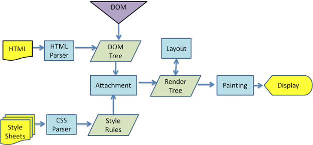
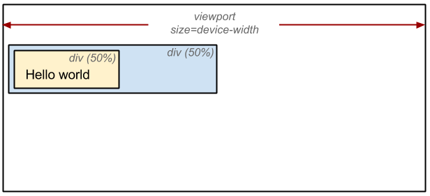

- [回流与重绘](#回流与重绘)
  - [浏览器渲染过程](#浏览器渲染过程)
  - [生成渲染树](#生成渲染树)
  - [回流](#回流)
  - [重绘](#重绘)
  - [触发条件](#触发条件)
  - [浏览器的优化机制](#浏览器的优化机制)
  - [优化点](#优化点)

# 回流与重绘

想要深入了解浏览器的回流或重绘，需要先知道浏览器的工作原理。

## 浏览器渲染过程

浏览器的渲染流程如下：



总结来说，如下：

- HTML 解析为 DOM 树，CSS 解析为 CSSOM 树，然后 DOM 和 CSSOM 合并为渲染树（Render Tree）
- 布局（Layout）：根据渲染树进行布局，得到节点的几何信息（位置、大小）
- 绘制（Painting）：根据渲染树和布局得到的几何信息，得到节点的绝对像素
- 显示（Display）：将像素发送给 GPU，显示在页面上

## 生成渲染树


构建渲染树的流程如下：

- 从 DOM 树的根节点开始遍历所有**可见**节点
- 对于每个可见节点，找到其在 CSSOM 中的对应样式并应用
- 最后，将所有节点和样式组合成渲染树

上面提到了可见节点，因此我们需要知道，什么样的算是可见节点。**不可见节点如下**：

- 不会渲染到页面上的节点。例如 `script`, `meta`, `link` 节点
- 通过 CSS 隐藏的节点。例如：`display: none`

  > 注意：通过 `visibility` 或 `opacity` 隐藏的节点，仍会被添加到渲染树上，所以会在页面上渲染，只不过是人眼不可见而已。

## 回流

生成了渲染树之后，还需要知道元素在页面上的具体位置，这个计算元素具体位置的阶段就是回流。

例如，有以下节点：

```html
<div style="width: 50%">
  <div style="width: 50%">Hello world</div>
</div>
```

在回流阶段，会根据视口（viewport）的具体宽度，计算这些节点的位置。如图所示：



## 重绘

经过了构造渲染树和回流阶段，接下来需要将渲染树上的节点都转换为屏幕上的实际像素，这个阶段就叫重绘。

## 触发条件

触发回流的条件如下：

- 页面一开始渲染的时候（无法避免）
- 删除 / 添加可见 DOM 元素
- 浏览器窗口大小变化
- 元素位置变化
- 元素尺寸变化（包括 `margin`, `padding`, `border` 等）
- 元素内容变化。比如：文字变化、图片大小改变
- 激活 CSS 伪类（例如 `:hover`）

## 浏览器的优化机制

现代的浏览器都很聪明，自身是有一些优化策略的。其中**浏览器会维护一个队列，把所有引起回流、重绘的操作放入这个队列中，等到队列中的操作达到一定的阈值或达到一定的时间间隔，浏览器就会刷新这个队列，批量执行其中的操作，这样就使得多次回流重绘变成了一次回流重绘**。

当你使用某些属性时，浏览器会强制刷新维护的队列，并立即进行回流、重绘，因此要尽量避免使用这些属性。这些属性部分如下：

```
offsetTop、offsetLeft、offsetWidth、offsetHeight
scrollTop、scrollLeft、scrollWidth、scrollHeight
clientTop、clientLeft、clientWidth、clientHeight
getComputedStyle()、currentStyle()
getBoundingClientRect()、getClientRects()
```

查看所有会引起回流或重绘的属性，点击[这里](https://gist.github.com/paulirish/5d52fb081b3570c81e3a)。

## 优化点

- 将多次修改 CSS 样式，合并为一次修改

  有以下两种方法：

  - 将样式通过 CSS 的 `class` 一次性添加
  - 使用 `cssText`（兼容性较差）

    ```js
    var elem = document.getElementById('div');
    elem.style.cssText = 'margin: 10px; padding: 5px;';
    ```

- 使用 `transform` 代替 `top`、`bottom`、`left`、`right`
- 使用 `opacity` 代替 `visibility`
- **离线修改** DOM 样式

  具体步骤是：先将 DOM 隐藏（`display: none;`），然后修改样式，最后在将其显示（`display: block;`）。

  这种方法只会在隐藏、显示 DOM 的时候触发回流，因此适用于频繁修改样式的操作。

- 使用**文档片段**（`DocumentFragment`），将频繁的 DOM 操作合并
- 减少使用那些会强制刷新 flush 队列的属性，如果使用不要放在循环中
- 尽量避免 `table` 布局

  1. HTML 中的 `table` 布局，只要其中的一个元素发生变化，就会引起整个 `table` 的回流、重绘。
  2. 浏览器在渲染 `table` 布局的时候，会花费比同等其他 DOM 元素多好几倍的时间。

- 动画的的频率不要设置太高
- 将动画涉及的 DOM 元素放入单独的合成层
- 使用 GPU 加速
