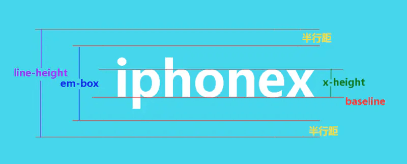

# 深入理解 font-size

## 字体相关概念

### 基线

基线就是图中 x 字母下面的线，所有的字符都是基于这条线定位的。`vertical-align: baseline;` 就是指的这条线。

### em-box

`1em` 和 `font-size` 的大小一致，而 `em-box` 就是 `1em` 的大小。例如，`font-size: 20px` 那么 `em-box` 就是 `20px`。

### content-area

这个区域没有在图中标出，`content-area` 翻译成中文就是内容区域，默认情况下，和 `line-height` 一样高。

给**内联元素**设置一个背景，这个背景就可以看作是内容区域。

`content-area` 与 `font-size` 和 `font-family` 有关。因此，有时我们设置了相同的 `font-size`，但是实际显示大小却不同，这就是因为 `font-family` 不同导致的。

### 半行距

行距的计算是：`content-area` - `em-box`，也就是 `line-height` - `font-size`。半行距就是行距的一半。

### x-height

`x-height` 顾名思义就是 `x` 字符高度的意思。这个概念通常没什么用，但是有助于我们理解一些概念，例如：`vertical-align: middle;` 这个属性指的就是，与 `x-height` 高度的一半对齐。
