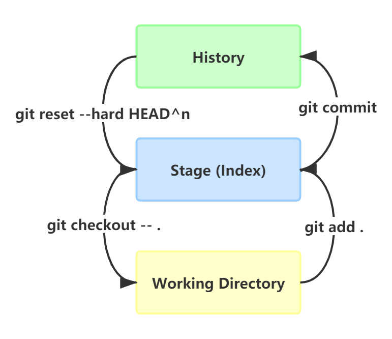
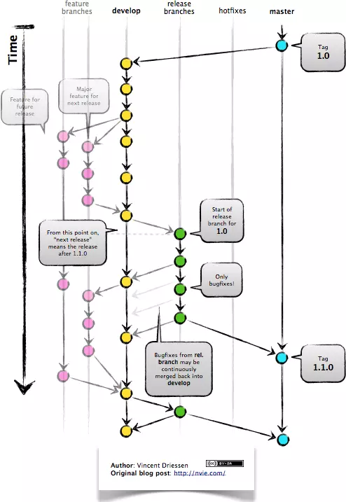
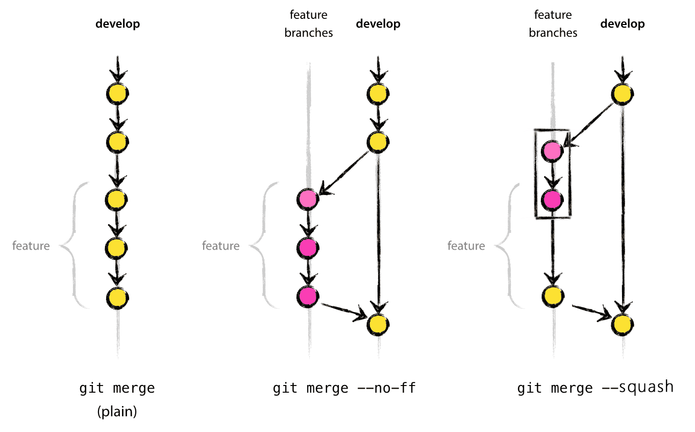

## Vim 操作

使用 Git 就避不开 Vim 的使用，一个最经典的的操作就是：如何保存并退出 Vim 编辑器。这个操作在 [Stack Overflow ](https://stackoverflow.com/questions/11828270/how-do-i-exit-the-vim-editor) 上的浏览量已经超过了 210 万次，可见其重要性。

下面是 Vim 的一些常用操作：

- `:q`（`:quit`）退出。

  如果内容更改了，则该操作无效。

- `:q!`（`:quit!`）强制退出。等价于 `ZQ`

  即使内容更改了，该操作也会生效，更改的内容丢失。

- `:wq` 保存并退出。

  无论内容是否更改，都会执行写操作。

- `:wq!` 强制保存，并退出。

  即使文件只有读权限，没有写权限，也要强制写入。

- `:x` 保存并退出。等价于 `:exit` 和 `ZZ`。

  仅当内容更改时，才执行写操作。

- `:qa`（`:quitall`）退出所有。

  如果内容更改了，则该操作无效。

- `:cq` 不保存并退出。

  会使 Vim 返回 non-zero 错误，效果是会强制退出。

执行 Vim 指令的步骤是：按下 `Esc` 键，然后输入 `:` + 操作指令（例如：`:wq`），最后按下 `Enter` 键。

刚进入 Vim 编辑器时，是无法直接修改内容的，需要按下 `Insert` 键，才可以进行编辑。按两次 `Insert` 键是进行替换操作。

## Git Bash

Git Bash 是 Git 的命令行工具，但它不等价于 Windows 中自带的 CMD 窗口。

Git Bash 中内置了一些 Linux 指令，例如：

- `cat` 指令，用于显示文件内容。

  - 语法：`cat 文件路径`

  - 使用示例：

    - `cat a.txt`
    - `cat dir1/a.txt`

- `ls` 指令，用于查看当前目录下的所有文件。

  默认不显示隐藏文件，常用的参数有：

  - `ls -sh` 显示文件大小。
  - `ls -ah` 显示隐藏文件。
  - `ls -sh -ah` 显示文件大小，并显示隐藏文件。

- `pwd` 指令，显示当前目录的绝对路径。
- `touch` 指令，新建一个文件。

  - 语法：`touch 文件名1 文件名2 ...`
  - 使用示例：

    - `touch a.txt`
    - `touch a.txt b.txt`

- `mkdir` 指令，新建文件夹。

  该指令是 `make directory` 的缩写。

  - 语法：`mkdir 文件夹名称1 文件夹名称2 ...`
  - 使用示例：

    - `mkdir dir`
    - `mkdir dir1 dir2`

- `rm` 删除一个文件

  - 语法：`rm 文件名1 文件名2 ...`
  - 使用示例：

    - `rm a.txt`
    - `rm a.txt b.txt`

  默认该指令无法删除文件夹，如果想删除文件夹，需要 `-r` 参数：`rm -r 文件夹名称`

- `mv` 移动文件

  - 语法：`mv 文件移动前的路径 文件移动后的路径`
  - 使用示例：`mv dir1/a.txt dir2/`

  > 必须保证路径中的目录都存在，否则会失败。

- `clear` 清屏

在 Git Bash 中，粘贴的快捷键不是 `Ctrl + v`，而是 `Shift + Insert`。

## NPM 修改源

```bash
# 修改 NPM 源地址为淘宝源
$ npm config set registry http://registry.npm.taobao.org/

# 修改 NPM 源地址为官方源
$ npm config set registry https://registry.npmjs.org/

# 通过指令参数指定源
$ npm install xxx --registry=https://registry.npm.taobao.org
```

## Git 基础概念

首先，工作区（Working Directory）、暂存区（Stage）和历史记录区（History）的交互，如下图所示：



一张图解 Git：


## Git Flow 基本流程和理解

Git 的标准操作流程，包括如下几个关键的分支：

| 分支名  | 作用                                                                                               |
| :-----: | :------------------------------------------------------------------------------------------------- |
| master  | 主分支                                                                                             |
| develop | 主开发分支，包含确定即将发布的代码                                                                 |
| feature | 新功能分支，一般一个新功能对应一个分支，对于功能的拆分需要比较合理，以避免一些后面不必要的代码冲突 |
| release | 发布分支，发布时候用的分支，一般测试时候发现的 bug 在这个分支进行修复                              |
| hotfix  | hotfix 分支，紧急修 bug 的时候用                                                                   |

Git Flow 的优点：

- 并行开发

  Git Flow 可以很方面的支持并行开发。每个新功能都会建立一个新的 feature 分支，从而将各个功能隔离开来。

- 协作开发

  每个 feature 分支上的改动，都是针对某个新功能。

- 版本发布

  如果要发布版本，把 feature 分支合并到 develop 分支，然后从 develop 分支新建 release 分支来发布新版本。

- 紧急修复

  紧急修复只影响已经发布的 tag，不会影响正在开发的新功能。

Git Flow 具体流程详解：

1、feature 分支都是从 develop 分支创建。开发完后再合并到 develop 分支上，等待发布。如图所示：


2、进行测试，从 develop 分支创建 release 分支。如图所示：


然后，release 这个分支会进行 CI 测试，如果有问题，就在这个分支进行修复。在修复所有问题前，不停地进行流程“发布->测试->修复->重新发布->重新测试”。

3、发布版本，将 develop 分支合并到 master 分支。如图所示：



> 其中，master 分支只跟踪已发布版本的代码。合并到 master 上的 commit 只能来自 release 分支和 hotfix 分支。

4、紧急修复，通过 master 分支上的某个 tag 建立 hotfix 分支。如图所示：


> 解决完问题后，将 hotfix 分支合并到 master 分支和 develop 分支上。

以上就是 Git Flow 的基本流程。其关键点在于：

- 对于 feature 流程

  从 develop 分支新建 feature 分支，解决完问题后，通过 PR/MR 合并回 develop 分支。

- 对于 release 流程

  将 feature 合并到 develop，然后从 develop 分支新建 release 分支，release 分支会进行 CI 测试。如果 CI 测试有问题，则直接在 release 分支上修复，然后通过 PR/MR 合并到 develop 分支。如果 CI 测试没问题，将 release 分支合并到 master 分支，发布新版本。

- 对于 hotfix 流程

  hotfix 分支是基于 master 分支上的某个 tag 新建的，修复了问题之后要同时合并到 master 分支和 develop 分支。

## 常用指令

- 配置 log 指令输出样式和别名

  ```bash
  $ git config --global alias.lg "log --color --graph --pretty=format:'%Cred%h%Creset -%C(yellow)%d%Creset %s %Cgreen(%cr) %C(bold blue)<%an>%Creset' --abbrev-commit"
  ```

- 和远程仓库交互

  - 本地仓库和远程仓库关联

    ```bash
    $ git remote add origin <远程仓库地址>
    ```

  - 查看关联的远程仓库

    ```bash
    $ git remote -v
    ```

  - 更换关联的远程仓库

    ```bash
    # 首先，删除原本关联的远程仓库
    $ git remote rm origin

    # 然后，重新关联
    $ git remote add origin <远程仓库地址>
    ```

  - 强制拉取远程仓库，并覆盖本地仓库

    ```bash
    $ git fetch --all
    $ git reset origin/master --hard
    $ git pull origin master
    ```

    > 该操作会使本地的修改全部丢失，使用远程仓库中的提交历史。

  - 删除远程分支 / 标签

    ```bash
    # 删除远程分支
    $ git push origin :<分支名>

    # 删除远程标签
    $ git push origin :<标签名>
    ```

- 撤销 commit

  ```bash
  $ git reset HEAD~n
  # 或
  $ git reset <commit id>
  ```

  该操作只会撤销 commit，不会撤销代码。如果需要撤销 commit 和代码，需要加上 `--hard` 参数，即 `git rebase HEAD~n --hard`。

- 修改 commit 记录

  - 修改最新的 commit 记录

    ```bash
    $ git commit --amend
    ```

  - 修改之前的 commit 记录

    假设有几次提交：

    ```bash
    A — B — C — D — E
    ```

    - 修改某次提交，并删除后面的提交

      例如，要修改 C 提交，并且删除 D，E 提交：

      ```bash
      $ git reset --soft C
      ```

      结果如下：

      ```bash
      A — B — C
      ```

    - 修改某次提交，并保留其他的提交

      例如，要将 C 提交放到 A 提交后面，并保留其他的提交：

      ```bash
      # 以 A 提交为基准，新建临时分支
      $ git checkout -b tmp A

      # 此时，tmp 分支上最新的提交是 A
      # 然后，将 C 提交拿过来
      $ git cherry-pick C

      # 如果想修改 C 提交，执行这个，否则跳过
      $ git commit --amend

      # 最后，把其他的所有提交都拿过来
      $ git cherry-pick B D E
      ```

      结果如下：

      ```bash
      A — C — B — D — E
      ```

- 修改他人贡献的 PR（不是先合并再修改）

  问题描述的大概是这样：

  

  实现这样的操作之前，你需要知道以下几点：

  - 当他人向你贡献 PR 时，会提前 Fork 你的仓库
  - **PR** 会和**提出 PR 的分支**关联并同步，所以只需修改分支上的提交，PR 就会自动更新

  如果你觉着他人贡献的 PR 有问题，想对其进行修改，并且希望把你的 commit 追加到这个 PR 上。那么，你只需要将你的 commit 提交到他人 Fork 你的仓库副本中即可（你对他人 Fork 你的仓库副本有一些控制权力）

  我们假设，你的项目名为 `pr-test`，Github 用户名为 liuyib 的人给你贡献了 PR，并且 PR 的 ID 是 411，提出 PR 的分支名为 `patch-1`。

  操作步骤如下：

  ```bash
  # 拉取 PR 对应的分支
  $ git pull origin pull/411/head:patch-1
  # 切换到该分支
  $ git checkout patch-1

  # 你做了修改，然后提交代码
  $ git add .
  $ git commit -m "你的修改描述"

  # 将你的本地工作区与贡献者 Fork 你的仓库副本关联起来
  $ git remote add liuyib https://github.com/liuyib/pr-test.git
  # 将你的修改推送到仓库副本中
  $ git push liuyib patch-1
  ```

  这样，你的 commit 就会同步到他人贡献的 PR 中。修改了 PR 之后，你可以将**与贡献者仓库的关联**删除：

  ```bash
  $ git remote rm liuyib https://github.com/liuyib/pr-test.git
  ```

  > 如果这个贡献者仍可能向你贡献 PR，并且你也可能会帮他修改 PR，那么就不需要删除。

- 只将修改的文件添加到暂存区，新文件不添加

  ```bash
  $ git add --update(-u)
  ```

- 工作区被弄得很乱，想放弃所有修改

  比较建议的方法：

  ```bash
  # 放弃指定文件的修改
  $ git checkout -- <file>

  # 放弃所有文件的修改
  $ git checkout -- .
  ```

  甚至可以用一些奇怪的方法：

  ```bash
  # 先将修改提交到历史记录
  $ git add .
  $ git commit -m "xxx"

  # 然后进行如下操作：
  # 1. 使用 git rebase 删除刚才的提交
  $ git rebase -i HEAD^n

  # 2. 使用 git reset 回退
  $ git reset --hard HEAD^n
  ```

- 查看执行过的所有命令

  ```bash
  $ git reflog
  ```

## git add 和 git stash 的区别

两者是同义的。这是由于要跟 SVN 中的 `svn add` 指令进行区别。Git 和 SVN 的 `add` 指令功能完全不同。`svn add` 是将修改加入版本控制（历史记录），`git add` 是将修改提交到暂存区。

由于从 SVN 转到 Git 的用户比较多，为了避免误导，Git 引入了 `git stage`，作用和 `git add` 一样，目的就是为了区别 SVN。

## git reset、git revert 和 git checkout 的区别

**从 commit 层面来说**：

- `git reset` 可以修改 HEAD 指针指向的 commit。

  当下次垃圾回收时，会把当前 commit 之后的 commit 回收掉。`git reset` 参数：

  - `--mixed`（默认）：修改暂存区、历史记录
  - `--soft`：修改历史记录
  - `--hard`：修改工作区、暂存区、历史记录

  > 由于使用 `git reset` 会删除 commit 记录，因此我要在公共的分支（例如 develop 分支）上使用。

- `git checkout` 可以将 HEAD 指针指向一个新的分支。
- `git revert` 和 `git reset` 的目的一样，但是做法不同。`git revert` 会以创建新 commit 的方式来撤销 commit。这样会保留之前的提交历史，比较安全。

  > Git 提交的前缀规范中，就有 `revert:` 前缀。

**从文件层面来说**：

- `git reset` 会把 commit 撤销，将文件修改回退到工作区（即默认保留文件修改）。如果使用 `--hard` 参数，则撤销 commit，但不保留文件修改。
- `git checkout` 默认用来切换分支，不影响工作区的文件修改。如果使用 `--` 参数，则撤销工作区的文件修改。
- `git revert` 不影响文件的修改。

## `git pull` 和 `git pull --rebase` 的区别

假设 Git 提交记录如下：

```
A — B — C ← Origin
         ↖ HEAD
```

当本地和远程都做了提交后：

```
            D ← Origin
         ／
A — B — C
         ＼
            E ← HEAD
```

这时，如果要提交代码的话，需要先将远程的提交拉取下来。这就要用到 `git pull` 指令，其执行结果如下：

```
A — B — C — — — — — — F ← HEAD
         ＼        ／
            E — D ← Origin
```

该指令会在拉取后，将**远程提交合并到本地提交的后面**（不考虑冲突），但是会多出一个用于合并信息的提交 F，这样会使得提交历史不再是一条直线。为了避免这样的结果，我们可以使用 `git pull --rebase`，执行结果如下：

```
A — B — C — D — — — — — E
             ↖ Origin   ↖ HEAD
```

该指令会在拉取后，将**本地提交合并到远程提交的后面**（不考虑冲突），提交历史仍是一条直线。

应用使用示例：

- `git pull --rebase` 的一个应用场景

  以 Github 为例，新建一个远程仓库，并勾选 `Initialize this repository with a README` 选项，这样会在新建仓库后，生成 README 并提交一条记录。此时，再初始化一个本地仓库，但是忘记执行 `git pull`，因此没有将远程仓库的 README 拉取下来，然后本地仓库做了一些修改并提交后，执行 `git push` 推送到远程，但是会发现被拒绝了，这时，可能会想到使用 `git pull` 来拉取远程提交，发现又失败了。这是因为两个仓库提交历史不相关，导致相互之间无法同步。

  解决方法是，使用 `git pull --rebase`，如果没有冲突，直接就可以合并成功，这时两个仓库的提交历史就关联了起来。如果有冲突，解决完冲突后，执行 `git add .`，然后再执行 `git rebase --continue` 即可。

## 分支操作

- `git branch` 查看本地分支
- `git branch --remote (-r)` 查看远程分支
- `git branch <分支名>` 创建分支
- `git checkout <分支名>` 切换分支
- **`git checkout -b <分支名>` 创建并切换分支**
- `git branch -d <分支名>` 删除本地分支
- `git branch -D <分支名>` 强制删除本地分支
- **`git push origin -d <分支名>` 删除远程分支**

  > 或 `git push origin :<分支名>`

- `git merge <分支名>` 合并分支

  常用参数：

  - `git merge --no-ff`
  - `git merge --squash`

  参数作用如图：

  

- `git fetch origin <分支名>` 拉取远程分支（只拉取不合并）
- `git pull origin <分支名>` 拉取远程分支（拉取并合并）

  > 等于 `git fetch` + `git merge`

## 储存区操作

- `git stash` 以最近的 commit 信息作为注释，暂存所有修改
- `git stash save "注释"` 指定注释，暂存所有修改
- `git stash list` 显示所有暂存数据
- `git stash clear` 清空所有暂存数据
- `git stash drop` 删除最近的暂存数据
- `git stash drop stash@{n}` 删除指定的暂存数据

  > `git stash drop stash@{0}` 等价于 `git stash drop`

- `git stash pop` 恢复最近的暂存数据，并删除
- `git stash pop stash@{n}` 恢复指定的暂存数据，并删除

  > `git stash pop stash@{0}` 等价于 `git stash pop`

- `git stash apply` 恢复最近的暂存数据，不删除
- `git stash apply stash@{n}` 恢复指定的暂存数据，不删除

  > `git stash apply stash@{0}` 等价于 `git stash apply`

## 标签操作

- `git tag <标签名>` 打标签
- `git tag <标签名> <commit id>` 指定 commit 打标签
- `git tag -a <标签名> -m "注释"` 打标签，并注释
- `git tag -a <标签名> -m <说明文字> <commit id>` 指定 commit 打标签，并注释
- `git tag` 显示所有标签
- `git show <标签名>` 查看标签的详尽信息
- `git tag -d <标签名>` 删除标签
- `git push origin -d <标签名>` 删除远程标签

  > 或 `git push origin :<标签名>`

- `git push origin <标签名>` 推送某个标签到远程
- `git push origin --tags` 推送所有标签到远程
- `git fetch origin --prune --tags` 将所有远程标签同步到本地

## .gitignore

`.gitignore` 文件大全：[Github gitignore](https://github.com/github/gitignore)。

- `git add -f <文件名>` 强制添加被忽略的文件
- `git rm --cached <文件名>` 删除对指定文件的记录

  > 如果文件已提交，那么 `.gitignore` 对该文件就会失效，这就需要删除对文件的记录。

  - `git rm -r --cached <目录名>` 删除对指定目录的记录
  - `git rm -r --cached .` 删除对所有文件或目录的记录

## 学习资源

- Git 指令可视化学习网站：[Learn Git Branching # DEMO](https://learngitbranching.js.org/?demo)
- Git 指令可视化练习网址：[Learn Git Branching # NODEMO](https://learngitbranching.js.org/?NODEMO)

---

参考资料：

- [面试中的那些 Git 问题 - 基础部分](https://juejin.im/post/59ecb3976fb9a0452724bde0)
