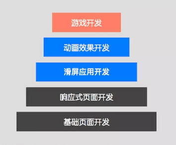
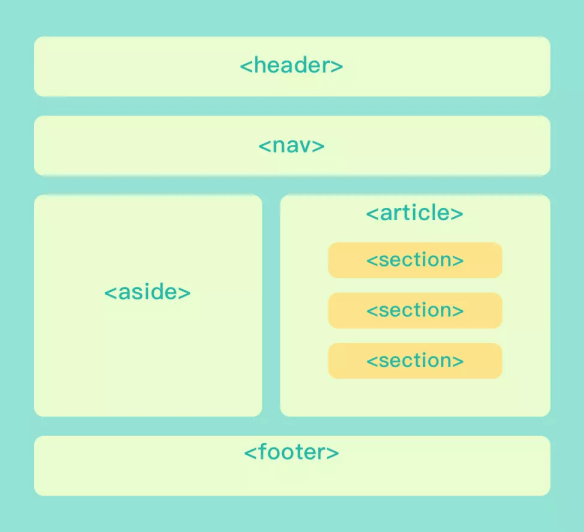

# 基础页面开发

## H5 开发能力参考模型



> 基础页面开发 -> 响应式页面开发 -> 滑屏应用开发 -> 动画效果开发 -> 游戏开发

## 分 5 步完成设计稿的页面开发

### 设计稿审查

  - 确定设计的开发友好性（是否有还原成本高 或 无法还原的地方）
  - 确定特殊元素是否有合理的边界处理（文案超出容器的边界怎么办）
  - 确定页面的整体结构框架（Layout）
  - 确定跨页面可复用的组件（Site Component）
  - 确定当前页面可复用的组件（Page Component）
  - ...

### 编写页面的骨骼框架

- 重置盒模型

  ```css
  *,
  *::before,
  *::after {
    -webkit-box-sizing: border-box;
    -moz-box-sizing: border-box;
    box-sizing: border-box;
  }
  ```

- 布局

  - 普通文档流布局
  - 浮动布局（Float）
  - 绝对布局（Absolute）
  - 弹性布局（Flex）
  - 网格布局（Grid）

  > 根据场景选择合适的布局方案

- 语义化

  进行语义化的目的：1、便于阅读和维护 2、SEO 友好

  

### 填充网页的内容

> 切图。下面是几种 PS 切图技巧

1、Extract Assets 资源生成器

  通过 `Extract Assets`，你可以：

  - 将 PSD 中的图层或图层组导出为一个或多个的图像资源
  - 导出 JPG、PNG、GIF 或 SVG 类型的图像资源
  - 为所有图像资源设置 1x、2x 等多分辨率的版本
  - 预览每个图像资源
  - 轻松将图像资源导出到你首选的文件夹中
  - 确保每当 PSD 发生变化时，被导出的资源都能得到自动更新

  **使用方法：**

  - 首选项 -> 增效工具 -> 启用生成器
  - 打开 PSD 文件后，选择：文件 -> 生成 -> 图像资源
  - 更改图层或图层组的名字为适当的文件格式扩展名

  > 这样资源生成器默认会在 PSD 的同一层目录下创建 assets 文件夹，并根据你修改的扩展名生成图片。

2、Extract Assets 进阶

- 从一个图层或图层组中生成多个资源，请用半角逗号分隔该图层或图层组的名称

  ```text
  music.png, music.jpg, music_on.png
  ```

- 图像资源保存到子文件夹中

  ```text
  子文件夹/music.png
  ```

- 指定图像品质和大小参数

  > 默认情况下， JPEG 资源会以 90% 品质生成， PNG 资源会以 32 位图像生成， GIF 资源则会以基本 Alpha 透明度生成

  我们可以通过以下办法设置 JPEG 资源的参数：

- 添加所需的输出品质作为资源名称的后缀：`jpg(1-10)` 或者 `jpg(1-100%)`，例如：

  ```text
  music.jpg5
  music.jpg50%
  ```

- 添加所需的输出图片大小（相对大小或者支持的单位：px, in, cm 和 mm）作为该资源名称前缀。Photoshop 会相应的缩放图像，例如：

  ```text
  200% music.png
  240x300 music.png
  ```

  > 注意：前缀和资源名称之间要添加一个空格字符

- 为资源指定默认位置

  可以为生成的资源指定文件的默认位置，例如想将图层导出到 `hi-res/` （存放二倍图，并加上 `@2x` 的后缀），`lo-res/` 存放缩小 50% 的图标，可进行如下配置：

  A. 创建空图层
  B. 更改空图层的名称为 `default hi-res/@2x + 50% lo-res/`

3、PS 动作切图

用 `Extract Assets` 切图存在一个问题，它只能切画布范围内的资源，超出画布的部分会直接被裁减掉。如果想切完整的图片该怎么办？建议用原始的「导出图层」的方式来切图，步骤如下：

- 右键点击图层或图层组
- 选择转换为智能对象
- 编辑内容
- 导出图片

> 为了避免重复劳动，可以用 PS 录制一个切图动作。


### 润色

> CSS 编写起来比较容易，但是维护起来却不那么简单。这里重点说一下 CSS 的命名问题！

**BEM 命名法：**

BEM 的意思就模块（Block）、元素（Element）、修饰符（Modifier），使用这种命名方式可以让 CSS 的类名变得有实际意义且能自我解释，具有更高的开发友好性。

```text
Block - 模块，名字的单词之间用 `-` 符号连接。
Element - 元素，模块中的子元素，用 `__` 符号连接。
Modifier - 修饰符，表示父元素或子元素的其他形态，用 `--` 符号连接。
```

例如：

普通命名：

```html
<!-- S Search Bar 模块 -->
<div class="search-bar">
  <!-- input 输入框 -->
  <input class="input">
  <!-- button 搜索按钮 -->
  <button class="btn">
</div>
<!-- E Search Bar 模块 -->
```

使用 BEM 命名：

```html
<!-- S Search Bar 模块 -->
<div class="search-bar">
  <!-- input 输入框子元素 -->
  <input class="search-bar__input" />
  <!-- button 搜索按钮子元素 -->
  <button class="search-bar__button"></button>
</div>
<!-- E Search Bar 模块 -->
```

通常会配合 CSS 预处理语言，如 Scss、Less 等。来一定程度上解决手写冗长的命名。

```css
.search-bar {
  &__input {
  }
  &__button {
  }
}
```

如果 HTML 嵌套层级越来越深，类名也会越来越长。那么如何解决 BEM 命名冗长的问题?

**姓氏命名法：**

姓氏命名法中 Block 就是「姓」，Element 就是「名字」，而 Modifier 就是这个人的状态。例如：「张三--很有钱」

例如：

使用 BEM 命名：

```html
<div class="app-market-answer">
  <div class="app-market-secheader"></div>

  <div class="app-market-answer-list">
    <div class="app-market-answer-item">
      <div class="app-market-answer-item-top"></div>
      <div class="app-market-answer-item-middle"></div>
      <a href="javascript:;" class="app-market-answer-item-bottom">去围观</a>
    </div>
  </div>
</div>
```

使用姓氏命名进行优化：

```html
<div class="app-market-answer">
  <div class="app-market-secheader"></div>

  <div class="app-market-answer-list">
    <div class="app-market-answer-item">
      <div class="app-market-answer-itop"></div>
      <div class="app-market-answer-imid"></div>
      <a href="javascript:;" class="app-market-answer-ibtn">去围观</a>
    </div>
  </div>
</div>
```

进一步优化：

```html
<!-- am = app_market -->
<div class="am-answer">
  <div class="am-secheader"></div>

  <div class="am-answer-list">
    <div class="am-answer-item">
      <div class="am-answer-itop"></div>
      <div class="am-answer-imid"></div>
      <a href="javascript:;" class="am-answer-ibtn">去围观</a>
    </div>
  </div>
</div>
```

**小结：**

- className 的命名应该尽量精短、明确，以英文单词命名，且全部字母为小写，避免意义不明的缩写。
- 单词之间用下划线 `_` 或 `-` 连接均可，但必须统一。
- 学习 BEM 的思想，参考使用姓氏命名法规范。
- 定义样式模块，提高代码的可复用性。

### 兼容性测试

对于兼容性测试，主要关注两点：

- 在不同浏览器、不同分辨率下网页的显示情况（HTML / CSS 兼容）。
- 在不同浏览器中网页能否正常使用（JS 兼容）。

**兼容性的基本原则是：**

> 渐进增强与平稳退化

**如果遇到兼容性问题，可以按如下步骤处理：**

- 确认触发的场景：什么浏览器，什么版本，什么情况下触发的问题，做到稳定复现。
- 找出问题原因：是什么问题导致的，具体表现如何？
- 确定解决办法：参考现成的解决方案，如哪些属性不能使用以及相应的 Hack 处理。
- **收集兼容性处理方法，积累成文档**。

---

本文来源于：[掘金小册 -- 大厂 H5 开发实战手册](https://juejin.im/book/5a7bfe595188257a7349b52a)，进行总结和概括后，作为笔记记录下来。
