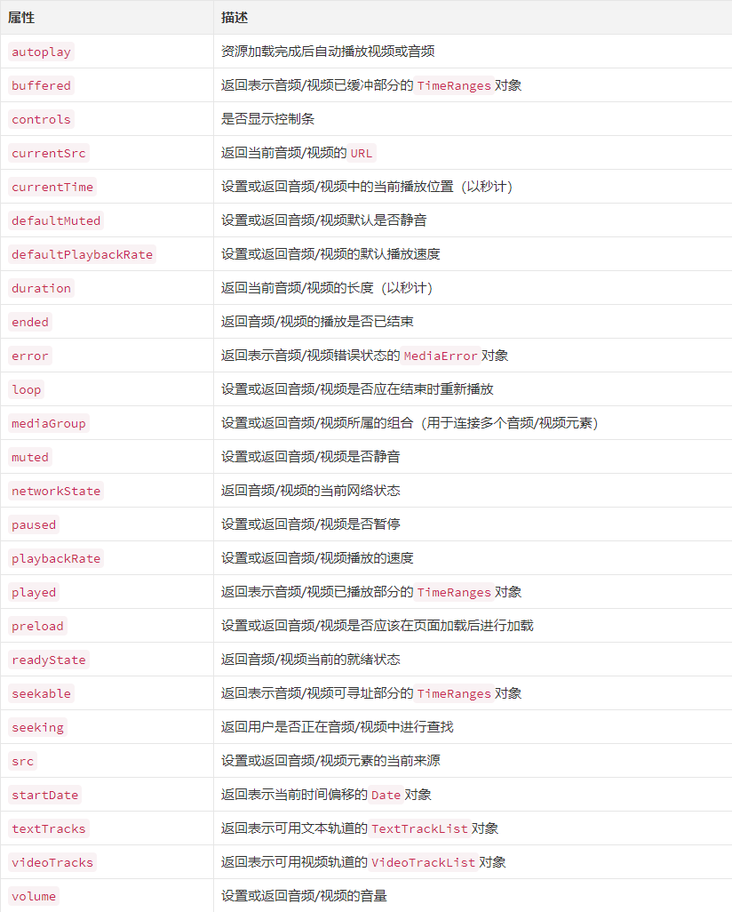
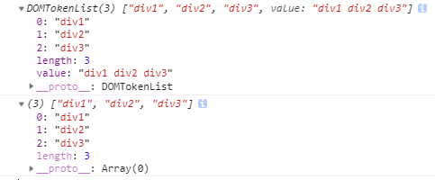
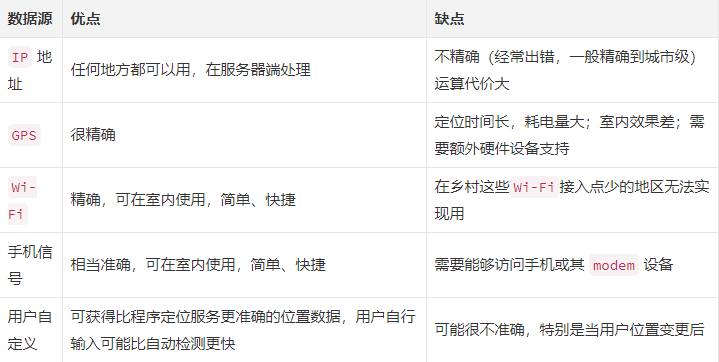
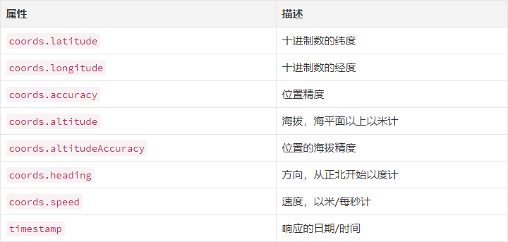

## HTML5知识总结

> HTML也先后经历了HTML4.01、XHTML1.0、HTML5几个重要的版本，在版本的演变过程中新增或废弃了一些属性，同时对语法规范也做了一些调整，为了能够保证浏览器可以兼容不同版本语法规范的，我们可以使用<!DOCTYPE>指示浏览器应该如何处理我们的HTML。

### 1、常用的DOCTYPE声明

```html
// 1、HTML5
<!DOCTYPE html>

// 2、HTML 4.01 Strict
// 4.01的严格版本，该DTD包含所有HTML元素和属性，但不包括展示性的和弃用的元素（比如font）。
// 不允许框架集（Framesets）。
<!DOCTYPE HTML PUBLIC "-//W3C//DTD HTML 4.01//EN" "http://www.w3.org/TR/html4/strict.dtd">

// 3、HTML 4.01 Transitional
// 该DTD包含所有HTML元素和属性，包括展示性的和弃用的元素（比如font）。
// 不允许框架集（Framesets）。
<!DOCTYPE HTML PUBLIC "-//W3C//DTD HTML 4.01 Transitional//EN" "http://www.w3.org/TR/html4/loose.dtd">

// 4、HTML 4.01 Frameset
// 该DTD等同于HTML 4.01 Transitional，但允许框架集内容。
<!DOCTYPE HTML PUBLIC "-//W3C//DTD HTML 4.01 Frameset//EN" "http://www.w3.org/TR/html4/frameset.dtd">

// 5、XHTML 1.0 Strict
// 该DTD包含所有HTML元素和属性，但不包括展示性的和弃用的元素（比如font）。
// 不允许框架集（Framesets）。必须以格式正确的XML来编写标记。
<!DOCTYPE html PUBLIC "-//W3C//DTD XHTML 1.0 Strict//EN" "http://www.w3.org/TR/xhtml1/DTD/xhtml1-strict.dtd">

// 6、XHTML 1.0 Transitional
// 该DTD包含所有HTML元素和属性，包括展示性的和弃用的元素（比如font）。
// 不允许框架集（Framesets）。必须以格式正确的XML来编写标记。
<!DOCTYPE html PUBLIC "-//W3C//DTD XHTML 1.0 Transitional//EN" "http://www.w3.org/TR/xhtml1/DTD/xhtml1-transitional.dtd">

// 7、XHTML 1.0 Frameset
// 该DTD等同于XHTML 1.0 Transitional，但允许框架集内容。
<!DOCTYPE html PUBLIC "-//W3C//DTD XHTML 1.0 Frameset//EN" "http://www.w3.org/TR/xhtml1/DTD/xhtml1-frameset.dtd">

// 8、XHTML 1.1
// 该DTD等同于XHTML 1.0 Strict，但允许添加模型（例如提供对东亚语系的ruby支持）。
<!DOCTYPE html PUBLIC "-//W3C//DTD XHTML 1.1//EN" "http://www.w3.org/TR/xhtml11/DTD/xhtml11.dtd">
```

### 2、语义化标签


尽量避免 `全局使用` 这些语义化标签。

### 3、浏览器对H5的支持

3.1、重置浏览器默认样式

> H5的新标签都是块级元素，但在旧的浏览器中，这些标签被当做行内元素（inline）对待，所以要统一重置为 display: block

3.2、解决IE678不支持H5语义化标签

> IE678虽然不支持H5语义化标签，但是支持 document.createElement 创建的自定义标签，所以，兼容方案就是将 H5 标签通过 js 全部重新创建一遍。

3.3、通过第三方库兼容IE678

> 实际开发中更多采用的是：通过检测IE的版本，来加载第三方库来解决兼容问题。这里有一个库 html5shiv 是一个比较好的IE678 兼容 H5 的第三方库。这个库会自动使用 document.createElement 创建所有 H5 标签来进行兼容。

```html
// 这些代码必须放在<head>元素里
<!--[if lte IE 8]>
  <script src="http://cdn.static.runoob.com/libs/html5shiv/3.7/html5shiv.min.js"></script>
<![endif]-->
```

上面 `lte` 表示 `小于等于`，也就是IE的版本小于等于8时，这段代码启用。

### 4、H5新增的表单类型，和表单属性

新增类型：网址 邮箱 日期 时间 星期 数量 范围 电话 颜色 搜索:
```html
<label>网址:</label><input type="url" name="">
<label>邮箱:</label><input type="email" name="">
<label>日期:</label><input type="date" name="">
<label>时间:</label><input type="time" name="">
<label>星期:</label><input type="week" name="">
<label>数量:</label><input type="number" name="">
<label>范围:</label><input type="range" name="">
<label>电话:</label><input type="tel" name="">
<label>颜色:</label><input type="color" name="">
<label>搜索:</label><input type="search" name="">
```

H5新增的一些表单属性:
```html
placeholder
required
autofocus    自动获得焦点（autofocus="autofocus"）
autocomplete 自动完成功能（autocomplete="on/off"）
novalidate   不使用表单元素的规则进行验证（novalidate="novalidate"）
multiple     多文件上传（multiple="multiple"）
form         绑定输入域（form="form元素的id值"）
pattern      自定义验证（pattern="正则表达式"）
```

修改 `placeholder` 属性样式:
```css
::-webkit-input-placeholder {
  color: red;
}
::-moz-placeholder { /* FF 19+ */
  color: red;
}
:-moz-placeholder { /* FF 4-18 */
  color: red;
}
:-ms-input-placeholder { /* IE 10+ */
  color: red;
}
```

表单元素不在 `form` 表单里时，使用 `form` 属性将表单元素绑定到 `form`:
```html
<form action="xxx.php" id="form1">
  用户名: <input type="text" name="username" />
  <input type="submit" value="提交" />
</form>
  密码: <input type="text" name="pwd" form="form1" />
```

### 5、新增表单元素 datalist

```html
<datalist id="list_input">
  <option value="Chrome" />
  <option value="Firefox" />
  <option value="Safari" /> 
</datalist>

<input type="text" list="list_input">
```

用的时候，需要有 `id`，然后把 `input` 的 `list` 属性绑定到这个 `id` 上。效果如下：


### 6、表单事件

表单中输入的内容无法通过表单元素自带的验证时触发 `oninvalid 事件`。
当验证无法通过时，可以使用 `setCustomValidity 方法` 来自定义错误提示，例如：

```javascript
pwd.oninvalid = function(){
  this.setCustomValidity("密码格式错误"); 
}
```


### 7、媒体元素

7.1、音频 `audio`

```html
<audio>
  <source src="xxx.ogg" type="audio/ogg">
  <source src="xxx.mp3" type="audio/mpeg">
  <source src="xxx.wav" type="audio/wav">
</audio>
```

audio 的一些常用属性：

```html
autoplay 自动播放
controls 是否显示控制条
loop    循环播放
```

7.2、视频 `video`

```html
<video width="300" height="200" controls>
  <source src="xxx.mp4" type="video/mp4">
  <source src="xxx.ogg" type="video/ogg">
</video>
```

### 8、媒体属性

8.1、buffered

> buffered 属性返回 TimeRanges 对象。TimeRanges 对象表示用户的音视频缓冲范围（单位：s）。
如果用户跳跃播放会得到多个缓冲范围。

`TimeRanges 对象` 属性：

- length - 获得音视频中已缓冲范围的数量
- start(index) - 获得某个已缓冲范围的开始位置
- end(index) - 获得某个已缓冲范围的结束位置

例如：获取视频第一段缓冲范围：

```javascript
var video = document.getElementById("video1");
alert("Start: " + video.buffered.start(0) + " End: " + video.buffered.end(0));
```

8.2、所有媒体属性



### 9、H5中DOM扩展

9.1、获取元素 `querySelector、querySelectorAll`

9.2、类名操作 `classList`

> classList 是一个 **类数组** 对象。类数组对象不是真正意义上的数组。可以通过 `索引` 或 `item 方法` 访问其中的元素。像数组一样，类数组对象也有 `length` 属性。

classList 的一些方法：

- item（通过索引获取元素）
- add
- remove
- toggle *
- contains（是否存在某个类名。返回 true / false）
- replace（用新类名替换旧类）

> add / remove 可以同时 `添加 / 删除` 多个类名，类名之间用逗号分隔。

> toggle
> 只有一个参数时，如果类名存在则删除，并返回 false ；如果类名不存在则添加，返回 true。
>
> 有两个参数时，第二个参数 **计算结果** 如果为 true，则强制添加；为 false，则强制删除。
>
> 注意：第二个参数可以是一个表达式。例如：`elem.classList.toggle('div1', i < 10);`
> 也可以是一个非 Boolean 类型的值，如果是一个非 Boolean 类型的值，会根据 `一定的规则` 将其转换为 Boolean 值。

一个实用技巧：利用数组原型对象 `Array` 上的 `slice`方法，将 **类数组对象** 转换为 **数组**：

```html
<div id="oDiv" class="div1 div2 div3"></div>
```

```javascript
var oDiv = document.getElementById('oDiv');

console.log(oDiv.classList); // => 类数组
console.log(Array.prototype.slice.call(oDiv.classList)); // => 数组
```

打印结果如下：



9.3、自定义属性

自定义属性随意命名，但要以 `data-` 开头。

例如：

```html
<div data-name="div-test"></div>
```

获取自定义属性（`node.dataset['xxx']`），设置自定义属性（`node.dataset['xxx'] = 'xxx'`），例如：

```html
<div data-name="zhangsan"></div>
<div data-name="zhangsan"></div>
<div data-name="zhangsan"></div>
```

```javascript
var aNames = document.getElementsByTagName('div');

for (var i = 0; i < aNames.length; i++) {
  var _data = aNames[i].dataset;
  console.log(_data['name']); // zhangsan
  
  _data['name'] = 'lisi';
  console.log(_data['name']); // lisi
}
```

### 10、网络状态

当用户通网时，触发 `online 事件`：

```javascript
window.addEventListener('online', function() {
  console.log('通网了');
});
```

当用户断网时，触发 `offline 事件`：

```javascript
window.addEventListener('offline', function() {
  console.log('断网了');
});
```

### 11、地理定位

11.1、获取定位的几种方式：

- IP
- GPS
- wifi
- 手机信号
- 用户自定义

几种方式比较：



11.2、隐私

> HTML5 Geolocation规范提供了一套保护用户隐私的机制。必须先得到用户明确许可，才能获取用户的位置信息。

11.3、使用地理定位

```javascript
// 获取当前地理信息
navigator.geolocation.getCurrentPosition(successCallback, errorCallback, options)

// 重复获取当前地理信息
navigator.geolocation.watchPosition(successCallback, errorCallback, options)
```

获取成功后，调用 `successCallback` 并返回一个包含位置信息的对象 `position`：



获取失败后，调用 `errorCallback` 并返回错误信息 `error`。
错误信息 `error` 的错误码（`error.code`）如下：


栗子：获取经纬度：

```javascript
window.navigator.geolocation.getCurrentPosition(
  function(pos) {
    var lati = pos.coords.latitude; // 经度
    var long = pos.coords.longitude; // 经度

    console.log("你当前的纬度为：" + lati + "经度为：" + long);
  }, function(err) { // 错误时回调信息
    if (err.code == 1) {
      alert("没有权限");
    } else if (err.code == 2) {
      alert("内部错误");
    } else {
      alert("超时");
    }
  }, {
    // 超时设置
    timeout: 5000
  }
);
```

### 12、web 储存

- `cookie` - 容量小，4K左右
- `sessionStorage` - 5M左右
- `localStorage` - 20M左右

12.1、关于 sessionStorage 和 localStorage

方法如下：

-  setItem(key, value) - 设置存储内容
- getItem(key) - 读取存储内容
- removeItem(key) - 删除键值为key的存储内容
- clear() - 清空所有存储内容
- key(n) - 以索引值来获取键名
- length  - 存储的数据的个数

```javascript
window.localStorage.setItem("username1", "Ryan's");
window.localStorage.setItem("username2", "Levi's");

window.sessionStorage.setItem("username1", "Ryan's");
window.sessionStorage.setItem("username2", "Levi's");

// 索引键的名字
console.log(window.localStorage.key(0));
console.log(window.sessionStorage.key(0));

// 取数据
console.log(window.localStorage.getItem("username1"));
console.log(window.sessionStorage.getItem("username1"));

// 获取本地数据的长度
console.log(window.localStorage.length);
console.log(window.sessionStorage.length);

// 删除数据
window.localStorage.removeItem('username1');
window.sessionStorage.removeItem('username1');

// 清空所有的数据
window.localStorage.clear();
window.sessionStorage.clear();
```

12.2、特点比较

`sessionStorage：`

- 关闭当前页面时，生命周期结束
- 不能多窗口共享数据（同源策略）
- 通过 a 进行页面跳转时，可以通过 sessionStorage 实现数据共享

`localStorage:`

- 生命周期永久有效，除非手动删除或用代码删除
- 可以多个窗口共享（同源策略）

12.3、三者特点比较

相同点：

> 都是储存数据，都是同源

不同点：

- cookie 每次请求都会带上，浪费带宽
- cookie 和 localStorage 都支持多窗口，而 `sessionStorage` 不支持多窗口，但是支持 `a 链接` 跳转的新窗口

### 13、文件读取

- FileList 对象 - 用户使用 `input` 上传文件后返回的对象

```html
<input id="oUpload" type="file" multiple name="upload" />
```

```javascript
var oUpload = document.getElementById("oUpload");

console.log(oUpload.files); // FileList {length: 0}
```

- FileReader 对象 - 用于读取本地文件内容

栗子：多文件上传：

```html
<input id="oUpload" type="file" multiple name="upload" />
<button id="oBtn">点击读取文件</button>
```

```javascript
var oBtn = document.getElementById("oBtn");
var oUpload = document.getElementById("oUpload");
var aFiles = [];

oBtn.onclick = function() {
  for (var i = 0; i < oUpload.files.length; i++) {
    aFiles[i] = new FileReader();
    aFiles[i].readAsDataURL(oUpload.files[i]); // readAsDataURL() 以 DataURL 形式读取文件
  }

  for (var i = 0; i < aFiles.length; i++) {
    aFiles[i].addEventListener("load", function() {
      var result = this.result; // 文件的base64编码

      var oImg = document.createElement("img");
      oImg.src = result;
      oImg.style.width = '100px';
      oImg.style.height = '100px';
      document.body.appendChild(oImg);
    });
  }
};
```

效果如下：


- `dataTransfer 对象` - 用户拖拽生成的对象（e 上的属性: `e.dataTransfer`）

> 给元素增加 draggable="true" 来设置元素是否可以被拖拽。img 和 a 默认是可以被拖拽的。

和拖拽有关的一些事件：

 - 对于拖拽元素

   - `ondrag` - 应用于拖拽元素，整个拖拽过程都会调用
   - `ondragstart` - 应用于拖拽元素，当拖拽开始时调用
   - `ondragend` - 应用于拖拽元素，当拖拽结束时调用

  - 对于目标元素

    - `ondragenter` - 应用于目标元素，当拖拽元素进入时调用
    - `ondragleave` - 应用于目标元素，当鼠标离开目标元素时调用
    - `ondragover` - 应用于目标元素，当鼠标经过目标元素时调用
    - `ondrop` - 应用于目标元素，当在目标元素上松开鼠标时调用

栗子：拖拽上传：

```html
<div id="oDrag">将图片拖拽至此</div>
```

```javascript
var oDrag = document.getElementById("oDrag");
var oHtml = document.documentElement;

// 在 html 对象上松开鼠标
oHtml.ondrop = function(e) {
  e.preventDefault();
};
// 鼠标经过 html 对象
oHtml.ondragover = function(e) {
  e.preventDefault();
};

// 在指定的 div 上松开鼠标
oDrag.ondrop = function(e) {
  var data = e.dataTransfer.files[0];
  var fr = new FileReader();
  fr.readAsDataURL(data);
  fr.addEventListener("load", function() {
    var result = fr.result;
    var img = document.createElement("img");
    
    img.src = result;
    oDrag.innerHTML = "";
    oDrag.appendChild(img);
  });
};
```


> 这里需要将 html 对象上的 ondrop、ondragover 默认事件给禁用掉。
