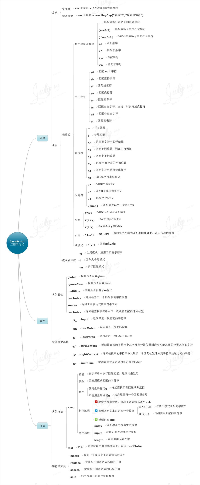

# 正则表达式 -- 快速复习笔记

## 知识图谱



## 书写风格

- JS 风格: `new RegExp(/a/, 'ig')`
- Perl 风格: `/a/ig`

## 可以使用正则的方法

- String 上的方法：
  + search `str.search(re)` -- 返回位置索引（失败返回 `-1`）
  + match `str.match(re)` -- 返回数组（失败返回 `null`）
  + replace `str.replace(re)`
  + split `str.split(re)`

- RegExp 上的方法：
  + test `re.test(str)` -- 返回 `true / false`
  + exec `re.exec(str)` -- 返回数组（失败返回 `null`）

> 注意几点：
> 1. `match` 不加参数 `g` 只会匹配一个值
> 2. `exec` 一次匹配只会匹配到一个值，如果想要匹配多个值，需要循环多次匹配
> 3. 如果只判断是否匹配，用 `test、search` 更方便

## 参数

- `i` -- `ignoreCase` 忽略大小写
- `g` -- `global` 全局匹配（贪婪匹配，默认是非贪婪匹配）
- `m` -- `multiline` 多行匹配
- `y` -- 执行“粘性”搜索（从 `lastIndex` 处开始匹配）

关于参数 `y` 的用法，举个例子：
```javascript
var str = '##foo##';
var regex = /foo/y;

regex.lastIndex = 2;
console.log(regex.test(str)); // true （此例仅当 lastIndex = 1 时匹配成功，这就是 sticky 的作用）
regex.lastIndex = 5;
console.log(regex.test(str)); // false （lastIndex 被 sticky 标志考虑到，从而导致匹配失败）
console.log(regex.lastIndex); // 0 （匹配失败后重置）
```

## 量词

- `+` -- 至少 1 个，等价于 `{1,}`
- `*` -- 至少 0 个，等价于 `{0,}`
- `?` -- 0 或 1 个，等价于 `{0,1}`
- `{}`
  + `{n}` -- 匹配 `n` 个
  + `{n,m}` -- 匹配 `n` 到 `m` 个
  + `{n,}` -- 匹配大于等于 `n` 个

> 注意：
> `?` 跟在任何量词后面，都会使量词变得 **非贪婪**

## 定位符

- `^` -- 字符串开头
- `$` -- 字符串结尾
- `\b` -- 匹配一个词的边界
- `\B` -- 匹配一个非 **单词边界**

> 注：
> - 不加参数 m（单行模式）：`^$` 表示 **整体** 字符串的开头结尾
> - 加上参数 m（多行模式）：`^$` 表示 **每行** 字符串的开头结尾

## 非打印字符

- `\f` -- 换页
- `\n` -- 换行
- `\r` -- 回车
- `\t` -- 制表（水平）
- `\v` -- 制表（垂直）
- `\s` -- 空白字符，包括：`空格、制表符、换页符、换行符`
- `\S` -- 非空白字符
- `\cX`

## 非捕获元

使用 `()` 有一个副作用就是相关匹配会被缓存，可以在 `()` 的最前面加上非捕获元来清除缓存。

- `?:` -- `(?:x)`
- `?=` -- `x(?=y)`
- `?!` -- `x(?!y)`

## 其他特殊字符

- `.` -- 匹配除了 **换行符以外** 的所有单字符
- `|` -- 或者
- `\d` -- 数字，等价于 `[0-9]`
- `\D` -- 非数字
- `\w` -- 数字、字母、下划线，等价于 `[0-9a-zA-Z_]`
- `\W` -- 非（数字、字母、下划线）
- `[\b]` -- 匹配退格（U+0008），不要和 `\b` 混淆了（`\b` 是匹配词边界）
- `\数字` -- 表示匹配阶段的捕获
- `$数字` -- 表示替换阶段的捕获
- `[]`
  + 或 -- `[abc]` 匹配 `a` 或 `b` 或 `c`
  + 范围 -- `[a-z]` 匹配 `a` 到 `z`
  + 排除 -- `[^0-9]` 匹配非数字
- `()` -- 捕获括号，匹配结果会储存在 **捕获** 里。
匹配阶段，**捕获** 用 `\1、\2 ...` 表示；替换阶段，**捕获** 用 `$1、$2 ...` 表示。
也用于 **设置匹配优先级**

对于 **捕获**，举个例子：
```javascript
console.log('abcd'.replace(/(b)(c)/, '$2$1')); // => acbd
// 捕获2（$2）会匹配 c，捕获1（$1）会匹配 b
```
