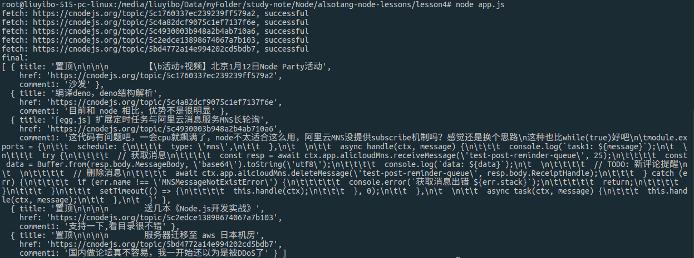

##### 使用 eventproxy 控制并发

使用的库 / 框架：

- express
- superagent
- cheerio
- eventproxy

代码如下：

```node
var eventproxy = require('eventproxy');
var superagent = require('superagent');
var cheerio = require('cheerio');
var url = require('url'); // node 里的 url 模块

var CNODE_URL = 'https://cnodejs.org';

superagent.get(CNODE_URL)
  .end(function (err, res) {
    if (err) {
      return console.error(err);
    }

    var topicUrls = []; // 要抓取话题的 url
    var $ = cheerio.load(res.text);

    $('#topic_list .topic_title').each(function (index, elem) {
      var $elem = $(elem);
      var href = url.resolve(CNODE_URL, $elem.attr('href'));

      if (index < 5) { // 只抓取 5 个 url 的第一条评论（抓太多会被网站限制）
        topicUrls.push(href);
      }
    });

    var ep = new eventproxy();

    // 重复监听 5 次 topic_html 事件后，在执行行动
    // topics 是一个数组，它包含了 ep.emit('topic_html', pair) 中的那 5 个 pair
    ep.after('topic_html', 5, function (topics) {
      topics = topics.map(function (topicPair) {
        // ep 从 emit 中接受到的参数。分别为 url 和 html
        var topicUrl = topicPair[0];
        var topicHtml = topicPair[1];
        var $ = cheerio.load(topicHtml);

        return ({
          title: $('.topic_full_title').text().trim(),
          href: topicUrl,
          comment1: $('.reply_content').eq(0).text().trim(),
        });
      });

      console.log('final：');
      console.log(topics);
    });

    // 同时抓取所有的 url
    topicUrls.forEach(function (topicUrl) {
      superagent.get(topicUrl)
        .end(function (err, res) {
          if (err) {
            console.log('error');
          }

          console.log('fetch: ' + topicUrl + ', successful');

          var _html = res.text;
          // 给 ep 发送 topic_html 事件
          ep.emit('topic_html', [topicUrl, _html]);
        })
    })
  });
```

效果如下：

