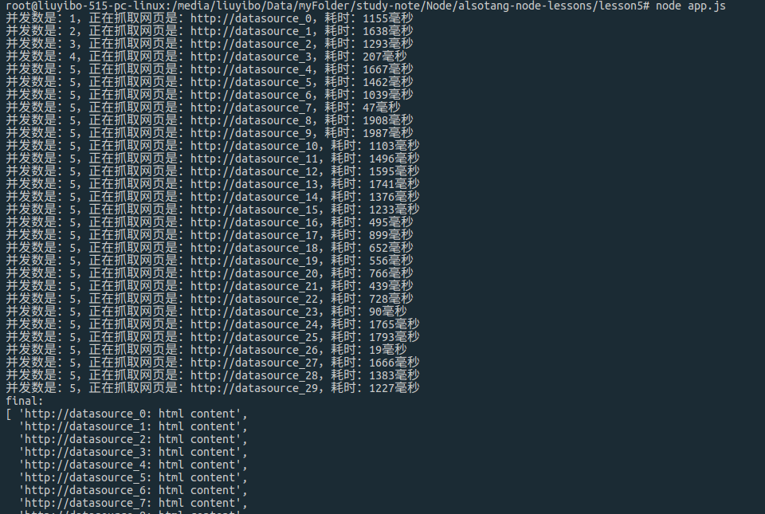

##### 使用 async 控制并发

> 对于什么时候用 eventproxy，什么时候用 async。一般是这样的：当你需要多个源（一般是小于 10 个）汇总数据的时候，用 eventproxy 方便；
> 当你需要用到队列时， 需要控制并发数，或者你喜欢函数式的编程思维时，使用 async。大部分场景是使用 eventproxy。

使用的库 / 框架：

- async

代码如下：

```node
var async = require('async');

var concurrenceCount = 0; // 并发数计时器
var fetchUrl = function(url, callback) {
  var delay = parseInt((Math.random() * 10000000) % 2000, 10); // 随即一个延迟时间

  concurrenceCount++;

  console.log('并发数是：' + concurrenceCount + '，正在抓取网页是：' + url + '，耗时：' + delay + '毫秒');

  setTimeout(function () {
    concurrenceCount--;
    callback(null, url + ': html content');
  }, delay);
};

// 伪造一组链接
var urls = [];
for (var i = 0; i < 30; i++) {
  urls.push('http://datasource_' + i);
}

// 使用 async.mapLimit 来并发抓取，并获取结果。
/**
 * mapLimit
 * 并发抓取网页
 * @param {Array} 一组网页 url
 * @param {Number} 并发连接的数量
 * @param {Function} 异步函数
 * @param {Function} 回调函数 
 */
async.mapLimit(urls, 5, function (url, callback) {
  fetchUrl(url, callback);
}, function (err, result) {
  if (err) {
    console.log('error');
  }
  
  console.log('final: ');
  console.log(result);
});
```

效果如下：

