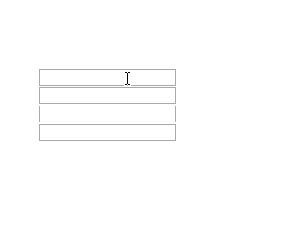

几种获取元素 / 组件引用的方式：

```js
import React, { Component } from "react";
import ReactDOM from "react-dom";

class App extends Component {
  constructor() {
    super();

    this.state = {
      a: "",
      b: "",
      c: "",
      d: ""
    };
    this.update = this.update.bind(this);
  }

  update(e) {
    this.setState({
      a: e.target.value,
      b: this.refs.bbb.value,
      c: this.ccc.value,
      d: ReactDOM.findDOMNode(this.ddd).value
    });
  }

  render() {
    return (
      <div>
        <input onChange={this.update} />
        {this.state.a} <br />

        <input ref="bbb" onChange={this.update} />
        {this.state.b} <br />

        <input ref={input => (this.ccc = input)} onChange={this.update} />
        {this.state.c} <br />
        
        <MyInput ref={component => (this.ddd = component)} update={this.update} />
        {this.state.d} <br />
      </div>
    );
  }
}

class MyInput extends Component {
  render() {
    return <input onChange={this.props.update} />;
  }
}

export default App;
```

总结一下，获取**元素 / 组件**引用的四种方法：

```js
// 直接获取（元素 / 组件）
e.target.value;

// 给元素添加 ref 属性，然后使用 this.refs.xxx 获取
this.refs.xxx.value;

// 给元素的 ref 属性传递回调函数，用来给 this.refs.xxx 起一个别名
this.xxx.value;

// 使用 react-dom 提供的 API，获取组件的引用
ReactDOM.findDOMNode(this.refs.xxx).value;
```

实现效果如下：



当组件中，要获取引用的元素不在最外层时，使用 `ReactDOM.findDOMNode(this.refs.xxx)` 无法获取到该元素的引用。

例如:

```js
class MyInput extends Component {
  render() {
    return (
      <div>
        <input onChange={this.props.update} />
      </div>
    );
  }
}
```

这种情况下，`input` 不在最外层，无法通过 `ReactDOM.findDOMNode(this.refs.xxx)` 获取这个 `input` 的引用。

可以给 `MyInput` 组件中的 `input` 元素添加 `ref`，然后进行再次引用：

```js
class MyInput extends Component {
  render() {
    return <div><input ref="myInput" onChange={this.props.update} /></div>;
  }
}
```

然后获取其引用：

```js
this.ddd.refs.myInput.value
```
