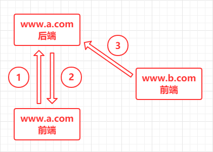

# CSRF 相关知识

## 什么是 CSRF

`Cross Site Request Forgy`（跨站请求伪造）简称 CSRF / XSRF：攻击者诱导受害者进入第三方网站，在第三方网站中，向被攻击网站发送跨站请求。利用受害者在被攻击网站中已经获取的注册凭证，绕过后台的用户验证，达到冒充用户对被攻击的网站执行某项操作的目的。

## CSRF 的攻击原理



1. 用户登录 A 网站
2. A 网站确认身份
3. B 网站页面向 A 网站发起请求（请求中带有 A 网站的身份）

其中攻击主要发生在第三步，攻击的特点如下：

- B 网站向 A 网站发送请求
- 请求中带有 A 网站的 Cookies
- 不访问 A 网站的前端，直接与 A 网站后端交互
- 发送的请求中，请求头 referer 为 B 网站

> 这里 A 网站表示遭受攻击的网站，B 网站表示发动 CSRF 攻击的网站

## CSRF 攻击实例

> 受害者 Bob 在银行有一笔存款，通过对银行的网站发送请求 `http://bank.example/withdraw?account=bob&amount=1000000&for=bob2` 可以使 Bob 把 1000000 的存款转到 bob2 的账号下。通常情况下，该请求发送到网站后，服务器会先验证该请求是否来自一个合法的 session，并且该 session 的用户 Bob 已经成功登陆。黑客 Mallory 自己在该银行也有账户，他知道上文中的 URL 可以把钱进行转帐操作。Mallory 可以自己发送一个请求给银行：`http://bank.example/withdraw?account=bob&amount=1000000&for=Mallory`。但是这个请求来自 Mallory 而非 Bob，他不能通过安全认证，因此该请求不会起作用。这时，Mallory 想到使用 CSRF 的攻击方式，他先自己做一个网站，在网站中放入如下代码： `src="http://bank.example/withdraw?account=bob&amount=1000000&for=Mallory"`，并且通过广告等诱使 Bob 来访问他的网站。当 Bob 访问该网站时，上述 url 就会从 Bob 的浏览器发向银行，而这个请求会附带 Bob 浏览器中的 cookie 一起发向银行服务器。大多数情况下，该请求会失败，因为他要求 Bob 的认证信息。但是，如果 Bob 当时恰巧刚访问他的银行后不久，他的浏览器与银行网站之间的 session 尚未过期，浏览器的 cookie 之中含有 Bob 的认证信息。这时，悲剧发生了，这个 url 请求就会得到响应，钱将从 Bob 的账号转移到 Mallory 的账号，而 Bob 当时毫不知情。等以后 Bob 发现账户钱少了，即使他去银行查询日志，他也只能发现确实有一个来自于他本人的合法请求转移了资金，没有任何被攻击的痕迹。而 Mallory 则可以拿到钱后逍遥法外。
>
> 例子引用来源：[IBM【https://www.ibm.com/developerworks/cn/web/1102_niugang_csrf/index.html】](https://www.ibm.com/developerworks/cn/web/1102_niugang_csrf/index.html)

## CSRF 攻击类型

- GET 类型

  GET 类型的 CSRF 攻击很简单，只需要一个简单的 HTTP 请求。例如：

  ```html
  
  ```

  当受害者访问这个页面时，浏览器就会立即向 `a.com` 发送一个 HTTP 请求。`a.com`就会收到一个包含受害者登录信息的跨域请求。

  > 防御：GET 方式不要用于更新资源

  <br />

- POST 类型

  POST 类型的 CSRF 攻击通常是利用一个自动提交的表单，例如：

  ```html
  <form target="csrf" method="post" action="http://a.com/post/article">
    <input type="hidden" name="id" value="13" />
    <input type="hidden" name="content" value="一个来自 CSRF 攻击的文本" />
  </form>

  <script>
    // 利用 iframe 进行提交，可以避免提交表单数据之后浏览器刷新
    var iframe = document.createElement("iframe");
    iframe.name = "csrf";
    iframe.style.display = "none";
    document.body.appendChild(iframe);

    setTimeout(function() {
      document.forms[0].submit();
    }, 100);
  </script>
  ```

  受害者访问这个页面后，表单就会自动提交，相当于模拟用户进行了一次 POST 提交。
  上面的表单提交的数据为：

  ```json
  {
    "id": 10,
    "content": CSRF攻击的内容
  }
  ```

  如果提交的这条数据被显示在页面上，并且提交的数据中 content 的内容为：`<a href="http://bbb.com">点击领取红包</a>`，那么页面中就会出现一个名称为：`点击领取红包` 的超链接。当用户点击这个超链接，会进入发动 CSRF 攻击的第三方网站，从而再次对受害网站进行了 CSRF 攻击。这样就产生了网络蠕虫。

- 超链接类型

  这种类型的 CSRF 攻击就是把 GET 类型的 CSRF 攻击链接嵌入了超链接中，通过诱导用户点击进行发动。

  ```html
  <a
    href="http://a.com/get/article?id=1000&content=CSRF攻击的内容"
    taget="_blank"
  >
    点击领取红包
    <a
  /></a>
  ```

  > 这种类型的攻击需要用户主动触发，所以并不常见

## CSRF 攻击的防御

首先要知道，CSRF 通常都是第三方网站发起的，被攻击的网站无法阻止攻击发生，所以只能通过增强自己网站对 CSRF 的防御能力来提升安全性。

主要有以下几点防御措施：

- 同源检测
- 设置 Samesite
- 添加 Token（**验证码** 和 **再次输入密码** 也有 Token 的作用）
- 双重 Cookie 验证

具体内容如下：

### 1、同源检测

CSRF 攻击大多数来自第三方网站，所以可以禁止跨域（不受信任的域名）请求。

判断请求是否来自跨域，有两种办法：

- 检测 Origin
- 检测 Referer

**使用 Origin 确定来源域名：**

在部分与 CSRF 有关的请求中，请求头中会携带 Origin 字段（包含协议和域名，不包含 path 和 query）。
如果 Origin 存在，直接使用 Origin 中的字段判断来源域名即可。
Origin 在下面的两种情况下并不存在：

- IE11 的同源策略
- 302 重定向

**使用 Referer 确定来源域名：**

这个字段记录了请求的来源地址。在 script、img、Ajax 等 **资源请求** 中，Referer 为发起请求的页面地址。对于 **页面跳转**，Referer 为打开页面历史记录中的前一个页面地址。

**新版本的 Referrer Policy 如下：**


关于这个策略的详尽信息，可以查阅：MDN. [Referrer-Policy
](https://developer.mozilla.org/zh-CN/docs/Web/HTTP/Headers/Referrer-Policy)

为了防御 CSRF，我们应该将 Referrer Policy 的策略设置为：**same-origin**。这样只要是跨域的请求就不会携带 Referer。

**设置 Referrer Policy 的方法有三种：**

- 在 <ruby>C S P<rp>（</rp><rt>内容安全策略</rt><rp>）</rp></ruby> 设置
- 使用 meta 标签设置
- a 标签添加 referrerpolicy 属性

**下面几种情况下 Referer 没有或者不可信：**

- IE6、7 下使用 `window.location.href=url` 进行页面跳转，会丢失 Referer。
- IE6、7 下使用 `window.open`，会丢失 Referer。
- HTTPS 跳转到 HTTP，浏览器中所有 Referer 都丢失。
- 点击 Flash 到达另外一个网站时，Referer 比较杂乱，不可信。

> 另外，如果 Origin 和 Referer 都不存在，建议直接阻止！特别是网站没有其他的 CSRF 防御措施作为再次检查。

**总结：**

同源验证是一个相对简单的防御办法，但这种方法只能防御 **跨域** 的 CSRF，对于本域的请求是起不到作用的。所以还需要进一步进行 CSRF 检查。

### 2、设置 Samesite

为了从源头上解决问题，Google 起草了一份草案来改进 HTTP 协议，那就是为响应头 `Set-Cookie` 增加 `Samesite` 属性（取值：`Strict / Lax`）。通过设置这个响应头，可以限制 / 禁止第三方网站请求携带 Cookies。

这个属性的两种取值的作用分别如下：

- `Samesite=strict`
  这种称为严格模式，表明 Cookie 在任何情况下都不能作为第三方 Cookie，绝无例外！

  ```http
  Set-Cookie: bar=xxx; Samesite=Strict;
  ```

  例如：
  淘宝网站用来识别用户登录与否的 Cookie 被设置成了 `Samesite=Strict`，那么用户从其他任意链接进入淘宝网站后，用户都不会是登录状态。

- `Samesite=Lax`
  这种称为宽松模式，比严格模式放宽了一些限制：如果一个请求是 GET 请求，并且这个请求改变了当前页面或者打开了新页面，那么这个 Cookie 可以作为第三方 Cookie。

  ```http
  Set-Cookie: bar=xxx; Samesite=Lax;
  ```

这个属性浏览器的支持情况如下（2019-3-16）：

**PC:**


**Mobile:**


> 可以看出 Samesite 的兼容性不是很好，所以并不能完全依靠这种办法。

**应该如何使用 Samesite:**

1. 如果设为严格模式，任何跨域请求都不会携带 Cookie，所 CSRF 基本没机会。
2. 如果设为严格模式，跳转子域名或在新标签页重新访问刚登陆的网站，之前的 Cookie 都不存在，需要重新登录，用户体验不好。
3. 如果设为宽松模式，其他网站通过链接跳转过来的时候可以使用 Cookie，但安全性相对较低。

**Samesite 的缺陷:**

1. 兼容性不好
2. 不支持子域

总之，Samesite 是一种可行的方案，虽然目前不太成熟，但前景可观。

### 3、添加 Token

使用 Token 进行防护分为三个步骤：

1. 将 Token 保存到页面中
   用户打开页面时，服务器给用户生成一个 Token（一般来说，Token 会根据：用户 ID、时间戳、随机数，然后用一个唯一的 key 进行加密获得）然后将这个 Token 存入服务器的 Session 中。之后每次页面加载时，使用 JS 遍历 DOM 树，在所有 a 和 form 标签后加入 Token（将 Token 保存到前端页面中）。

   > 这样可以解决大部分的请求，但是对于页面加载之后动态生成的 HTML 代码，这种方法就没有用了，需要程序员在编码时手动添加 Token。

2. 页面提交请求时携带 Token
   对于 GET 请求，将 Token 作为参数添加到 URL 中。
   对于 POST 请求，在 Ajax 请求加上 Token 字段、Form 的最后加上：

   ```html
   <input type="hidden" name="csrfToken" value="tokenValue" />
   ```

3. 服务器验证 Token 是否正确
   服务器接收到用户发送过来的 Token 之后，先使用 key 解密 Token，然后对比用户 ID 和时间戳，如果用户 ID 一致并且时间未过期，那么这个 Token 就是有效的。

> 对于 **验证码** 和 **密码** 其实也可以起到 Token 的作用，而且更安全。
> 比如：银行账户进行转账前，要求已经登录的用户再次输入密码，现在看是不是有一定道理了？

**使用 Token 要注意的点：**

- 通常，只需为当前会话生成一次 Token。在初始生成 Token 后，将其储存在会话中，并用于后续的每一个请求，直到会话结束。
- 用户发出请求时，要验证请求中 Token 的 **存在性** 和 **有效性**。如果请求中没有 Token，或 Token 的值与会话中储存的不一致，则要终止请求，然后 **重置 Token**。

**分布式校验：**

由于 Session 默认储存在单个服务器的内存中，所以在分布式环境下同一个用户发送的多次 HTTP 请求可能会先后落到不同的服务器上，导致后面的请求拿不到前面请求储存的 Session 数据。从而使得 Session 储存的 Token 在分布式环境下失效，因此在分布式集群中，CSRF Token 需要储存在 Redis 之类的公共储存空间中。

**实际使用：**

由于 Session 储存，读取和验证 Token 会引起很大的复杂度和性能问题，所以目前很多网站采取 `Encrypted Token Pattern` 方式。这种方式的 Token 是一个计算出来的结果，而非随机生成的字符串。这样在校验 Token 时，不用去读取储存的 Token，只需再计算一次即可。

这种方式计算出来的 Token 值，通常使用 UserID、时间戳和随机数，通过加密方法生成。

**缺点：**

- 实现较为复杂，给服务端造成压力。
- 所有用户，不论是否提交数据，都会生成一个 Token 并储存到 Session 中，造成资源浪费。
- 许多语言中 Session 是可选项，所有有的并不会使用 Session。

**总结：**

Token 是一种有效的 CSRF 防御方法，只要页面没有 XSS 漏洞泄漏 Token，那么 CSRF 就不会成功。
但是这种方法实现比较复杂，要给每个页面写入 Token，每个 Form 或 Ajax 请求都要携带 Token，后端要对每个接口进行校验。

### 4、双重 Cookie 验证

这种方式验证利用了 CSRF 攻击不能读取用户 Cookis 的特点（只会在请求时携带 Cookie）

双重 Cookie 验证采用以下的流程：

- 用户访问网站时，向请求的域名添加 Cookie 来储存一个 Token 值（例如：`csrf_token=v8g9e4ksfhw`）
- 当前端向后端请求数据时，取出 Cookie 中的 Token，并添加到 URL 的参数中（例如：POST `https://www.a.com/comment?csrf_token=v8g9e4ksfhw`）
- 后端验证 Cookie 中的 `csrf_token` 字段与 URL 参数中的 `csrf_token` 字段是否一致，不一致则拒绝。

**优点：**

- 无需在服务端使用 Session，简单，试用面广
- Token 储存在客户端中，不会给服务端造成压力
- 相对于 Token，可以前后端统一拦截校验

**缺点：**

- 如果存在 XSS 等漏洞，攻击者可以修改 Cookie，这种方法就会失效
- 难以做到子域名隔离（只要有子域名中存在安全漏洞，使得 Cookie 可控，就会威胁整站）
- 为了确保 Cookie 传输安全，整站要采用 HTTPS

由于任何跨域都会导致前端无法获取 Cookie，所以会发生以下情况：


> 这种方式的缺点是可控的，只要确保整站没有其他漏洞（XSS 等）泄漏 Cookie，这种方式就不会有问题。也就是说，这种方法的前提是：保证 Cookie 的安全！

## 结语

总之，防御 CSRF 并不能仅依靠一种办法，并且 CSRF 也不可能被完全阻止。我们能做的只有使用现有的方法来提高网站的安全性。

---

参考文献 / 资料：

- 美团前端. [前端安全系列（二）：如何防止 CSRF 攻击？](https://tech.meituan.com/2018/10/11/fe-security-csrf.html)
- OWASP. [跨站请求伪造（CSRF）](https://www.owasp.org/index.php/Cross-Site_Request_Forgery_%28CSRF%29)
- IBM. [CSRF 攻击的应对之道](https://www.ibm.com/developerworks/cn/web/1102_niugang_csrf/index.html)
- 慕课视频. [Web 前后端漏洞分析与防御](https://coding.imooc.com/class/104.html)
- phithon. [Cookie-Form 型 CSRF 防御机制的不足与反思](https://www.leavesongs.com/PENETRATION/think-about-cookie-form-csrf-protected.html#0x01-sessioncsrf)
