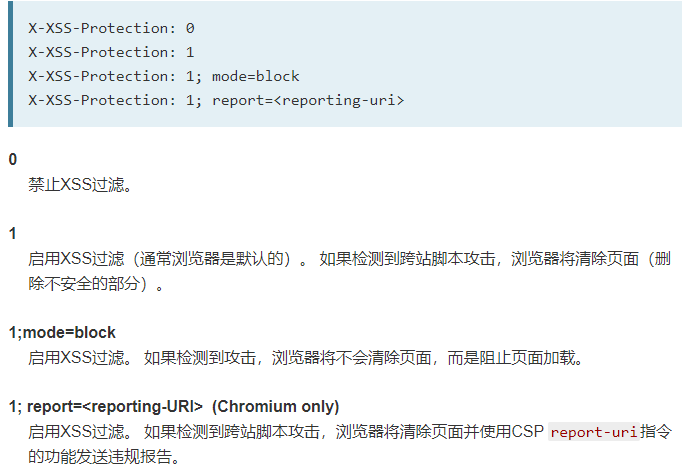

# XSS 攻击

## 什么是 XSS

`Cross-Site Scripting`（跨站脚本攻击）简称 XSS，是一种代码注入攻击。攻击者通过在目标网站上注入恶意脚本，使之在用户的浏览器上运行。

> XSS 的本质是：恶意代码未经过滤，与网站正常的代码混在一起；浏览器无法分辨哪些脚本是可信的，导致恶意脚本被执行。

## XSS 攻击方式

### 反射型

> 浏览器向服务器发出请求时，XSS 代码出现在 URL 中，作为输入提交到服务器端，服务器端解析后响应，XSS 代码随响应内容一起传回浏览器，最后浏览器解析执行响应内容，XSS 代码同时也被执行。
> 这个过程像一次反射，所以称作反射型攻击。

例子：

使用 express 脚手架（express-generator）搭建一个服务器
在 views/index.ejs 页面中添加代码：

```javascript
<%- xss %> // 注意这里的写法，不是 <%= %> ，因为不能让 XSS 代码进行转义，用 = 号就会进行转义
``` 

在 routes/index.js 中添加代码：

```diff
router.get('/', function(req, res, next) {
  res.set('X-XSS-Protection', 0);
  res.render('index', {
    title: 'Express',
+   xss: req.query.xss
  });
});
```

在浏览器地址栏输入：

```javascript
// onerror 会自动触发
localhost:3000/?xss=
```

在页面初始加载时，就会弹出 1，当点击未加载出的图片时，会弹出 2。从而实现了简单的 XSS 攻击。

需要注意的几个点：

- 攻击代码在 URL 中
- 服务端要解析 URL 中的查询参数，并返回给页面进行渲染
- 攻击使用的标签不限于 img，也可以是 iframe，script 等
  ```javascript
  // 加载一个页面
  localhost:3000/?xss=<iframe src="//baidu.com"></iframe>

  // 执行一个 JS 脚本
  localhost:3000/?xss=<script>document.body.innerHTML='you are attacked';</script>
  ```

> 这种方法有些浏览器会检测出来并阻止掉整个页面，也就是浏览器自带的 XSS 防御功能。

### 存储型

> 这种攻击方式与反射型的差别在于，存储型的攻击代码会储存在服务端（数据库、内存、文件中等），下次请求页面不用再次提交 XSS 代码

## XSS 攻击的注入点

- HTML 节点内容

  ```diff
  <div>
    ...
  +   文本中带有JS代码<script>alert(1);</script>
    ...
  </div>
  ```

- HTML 属性

  ```html
  <!-- 例一 -->
  <a href="javascript:alert('这是XSS脚本');">XSS</a>

  <!-- 例二 -->
  
  这里 src 属性的值是 null" onerror="alert('XSS脚本'); 其中包含的特殊字符改变了双引号的边界，从而被注入了 XSS 脚本
  ```

- JavaScript 代码

  ```js
  var data = ""; // 变量初始值
        ↓
  var data = "hello";alert('这是XSS脚本');""; // 获取数据后的值

  // 这里获取到的数据为 hello";alert('这是XSS脚本');" 其中包含的特殊符号改变了字符串的边界，从而被注入了 XSS 脚本
  ```

- 富文本

  > 由于富文本编辑器是通过添加 HTML 标签和属性来实现的，所以如果用户输入的信息中包含一些恶意脚本代码，那么这些恶意脚本代码也会被执行。

**这些 XSS 代码之所以能被显示在页面上，是因为没有对接收的数据进行过滤。**

## 进行转义、过滤来防御 XSS

> 防御大致思路：将用户输入的数据进行编码（转义），然后使用的时候进行解码，解码的同时进行过滤，把危险的几种标签（script、style、link、iframe、frame、img）、所有 JS 事件进行过滤。

### 转义

- **对 HTML 代码进行转义**

一般会对下面的字符进行转义：

字符|实体编号|实体名称
:---:|:---:|:---
`<`|`&#60;`|`&lt;`
`>`|`&#62;`|`&gt;`
`'`|`&#39;`|`&apos;`(IE不支持)
`"`|`&#34;`|`&quot;`
`&`|`&#38;`|`&amp;`
空格|`&#160;`|`&nbsp;`

示例代码：

```js
function escapeHtml(str) {
  if (!str) return '';

  // 首先对 & 符号进行转义（转义后的字符也带有 &，这样可以防止重复转义）
  str = str.replace(/&/g, '&amp;');
  str = str.replace(/</g, '&lt;');
  str = str.replace(/>/g, '&gt;');
  str = str.replace(/'/g, '&#39;');
  str = str.replace(/"/g, '&quot;');
  str = str.replace(/\s/g, '&#160;'); // 空白字符
  str = str.replace(/\n/g, '<br>');

  return str;
}
```

- **对 JS 代码进行转义**

如果数据中存在某些特殊符号，就会使得 JS 中的字符边界改变，从而产生新的 JS 语句，这些新的 JS 语句可以是任意的恶意脚本。

例如：

```js
// 有一个数据
var data = "";

// 当从服务端获取数据后 data 的值为
data = "hello";alert(1);"";

// 也就是说从服务端接收的数据为
hello";alert(1);"

// 这个数据改变了字符串的边界，并产生了另外的一些 JS 语句
```

转义的方法：

将 `'`，`"`，`\` 等进行转义

```js
function escapeJS(str) {
  if (!str) return '';

  str = str.replace(/\\/, '\\\\');
  str = str.replace(/"/, '\\&quot;');
  str = str.replace(/'/, '\\&#39;');

  return str;
}
```

上面的转义方法比较麻烦，而且可能会漏掉某些特殊字符，这里使用 `JSON.stringify` 进行转义最保险：

```js
JSON.stringify(str)
```

### 校正

将转义后的数据反转义得到字符串，使用 DOM Parse 转换字符串为 DOM 对象。然后进行过滤操作。

### 过滤

- 过滤危险的标签。例如：script、style、iframe、frame、img 等
- 过滤文本中包含的 JS 事件
- **对富文本过滤**（一般在客户端进行）

  > 过滤富文本相对来说比较复杂。由于富文本的实现原理是通过添加 html 标签和 css 属性，所以并不能直接将所有的标签和属性全过滤掉。有两种可选的方法：
  > 
  > - 黑名单过滤
  >   过滤危险的标签、属性、方法、以及一些特殊的代码（javascript:alert(1);）等
  > 
  > - 白名单过滤
  >   只保留安全的标签和属性

  过滤富文本时，需要解析 HTML，这里推荐使用第三方库 [cheerio](https://github.com/cheeriojs/cheerio) 来解析 HTML。使用 cheerio 解析 HTML 之后，会返回一个类似 DOM 的对象。

  <br />

  借助 cheerio 进行 XSS 过滤的示例代码：

  ```js
  // cheerio 解析后返回的对象如下：
  [
    {
      type: 'tag',
      name: 'img',
      attribs: {
        src: 'null',
        onerror: 'alert(1)'
      },
      // ...
    },
    // ...
  ]

  var xssFilter = function (html) {
    if (!html) return '';

    var cheerio = require(cheerio);
    var $ = cheerio.load(html);

    // 过滤白名单（举例！）
    var whiteList = {
      img: ['src'],
      font: ['size', 'color']
    };

    $('*').forEach(function (index, elem) {
      if (!whiteList[elem.name]) { // 元素名称不在白名单中
        $(elem).remove();
        return;
      }

      for (var attr in elem.attribs) {
        if (!whiteList[elem.name].includes(attr)) {
          $(elem).attr(attr, null); // 移除这个属性
        }
      }
    });

    return $.html();
  };
  ```

XSS 过滤的第三方库推荐：[js-xss](https://github.com/leizongmin/js-xss)

使用 js-xss 库过滤 XSS 脚本示例代码：

```js
var xssFilter = function (html) {
  if (!html) return '';

  var xss = require('xss');

  return xss(html, {
    whiteList: {
      img: ['src'],
      font: ['size', 'color'],
      // ...
    },
    onIgnoreTag: function () {
      // ...
    },
    // ...
  });
};
```

> 第三方库过滤 XSS 适用于快速开发。如果业务要求对每一种情况进行精确控制，那么还是需要自己手写过滤代码。

## 设置 HTTP 请求头 CSP 防御 XSS

CSP（内容安全策略）用于检测和减轻 Web 站点的特定类型的攻击，例如：XSS 和数据注入等。

该安全策略的实现基于一个 http 请求头： `Content-Security-Policy`。通过设置 CSP 的值来指定网页中哪些内容可以执行，哪些内容不可以执行。只有设置的内容才能被执行，没有设置的都会被阻止。

可以设置的内容有：


例如，指定内容能从 `文档源` 和 `www.example.com` 加载：

```js
Content-Security-Policy: default-src 'self' www.example.com
```

其中，`default-src` 包括：

- `child-src`
- `connect-src`
- `font-src`
- `img-src`
- `media-src`
- `object-src`
- `script-src`
- `style-src`

学习资料：[MDN：CSP (内容安全策略)](https://developer.mozilla.org/zh-CN/docs/Web/Security/CSP)

## 设置 HTTP 响应头 X-XSS-Protection  防御 XSS

通过设置 HTTP 响应头：`X-XSS-Protection: 1; mode=block`

这个请求头的其他值如下：



## 浏览器自带 XSS 防御

> 关于浏览器自带的 XSS 防御，只能防御反射型的 XSS 攻击。并且如果反射型的 XSS 代码被注入到 JS 中，那么浏览器并不会拦截。
