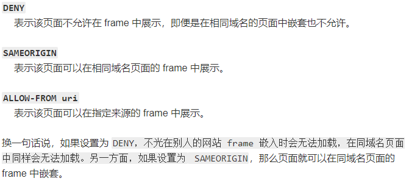

# 点击劫持攻击

点击劫持（ClickJacking）是一种视觉欺骗手段。基本攻击方式是用 iframe 将一个网站内嵌，然后 opacity 设为 0 进行隐藏，真实显示的是一些按钮等与用户交互的元素，诱导用户点击，而用户实际点击的是通过 iframe 内嵌的网站。从而进行一些非法操作，盗取用户敏感信息。例如：


除了上图中示例的劫持方式，还有点击劫持攻击还有以下几种：

1、图片覆盖攻击

使用具有恶意链接的图片覆盖原网页中的元素，当用户点击这个图片时，就会访问恶意链接。

2、拖拽劫持攻击

在浏览器中，拖拽的对象可以是链接，文字，也可以是从一个窗口到另一个窗口，因此拖拽不受同源限制。

拖拽劫持攻击的大致思路如下：使用透明度为 0 的 iframe 获取网站的数据，诱导用户拖拽 iframe 到攻击者可以控制的另一个页面。其中可以通过图片覆盖的方式进行诱导。

3、触屏劫持攻击

与前面所讲的类似，通过透明度为 0 的 iframe 覆盖网页来劫持用户的触屏点击操作。

## 防御点击劫持

### 使用 JS

当被其他网站使用 `iframe` 引用时，直接跳转回来：

```js
if (top !== self) {
  top.location = self.location;
}
```

> 当 JS 被禁用，这种方法就会失效。并且这种方法有很多避开的方法。

### 设置 HTTP 响应头 `X-Frame-Options`

取值如下：



> 这是一个非标准的 HTTP 响应头。CSP 标准中的 `frame-ancestors` 属性会代替它，可以和 CSP 结合起来使用。

详尽信息可以查阅：[MDN: X-Frame-Options](https://developer.mozilla.org/zh-CN/docs/Web/HTTP/X-Frame-Options)

### 设置 HTTP 响应头 CSP 的 `frame-ancestors` 属性

作用和 HTTP 响应头 `X-Frame-Options` 一样，是它的替代品。

使用示例：

- `Content-Security-Policy: frame-ancestors 'none';`

  不允许网站被嵌入 `iframe`，即使同源也不行。**如果没有特殊要求，建议设置为 `none`**

- `Content-Security-Policy: frame-ancestors 'self';`

  只支持当前站点使用 `iframe` 嵌套页面。

- `Content-Security-Policy: frame-ancestors 'self' '\*.somesite.com' 'https://myfriend.site.com';`

  允许当前站点、子域是 `somesite.com` 的任意站点(任何协议都行)、使用 HTTPS 协议，端口为 443(默认)的 `myfriend.site.com` 站点。

## 其他防御方法

在一些重要的按钮点击前，添加验证，比如：**二次输入密码**，**图形验证码**，使用 `window.confirm` 进行询问等。

---

参考资料：

[先知社区：Clickjacking 攻防](https://xz.aliyun.com/t/2179)
[GitHub: OWASP](https://github.com/OWASP/CheatSheetSeries/blob/master/cheatsheets/Clickjacking_Defense_Cheat_Sheet.md)
