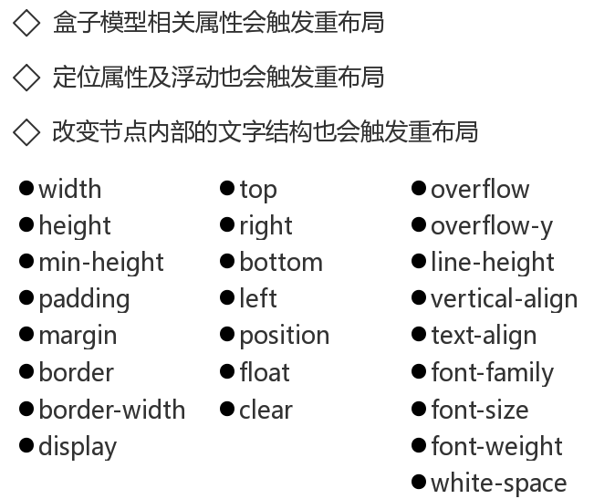
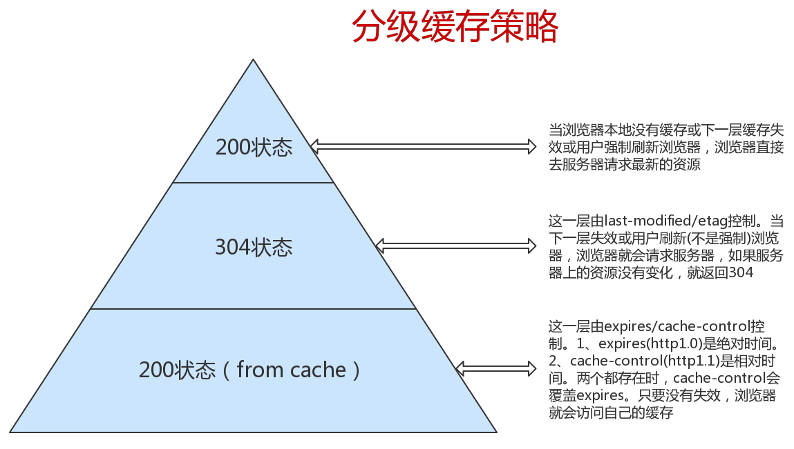

# Web 性能优化

- 网络层面
- 构建层面
- 浏览器渲染层面
- 服务端层面

> **深入理解 http 请求是前端性能优化的核心**

## 一个网络请求

浏览器的一个请求从发送到返回都经历了什么？


潜在的性能优化点：

- 是否可以通过缓存减少 dns 查询时间？
- 是否网络请求的过程走最近的网络环境？
- 相同的静态资源是否可以缓存？
- 能否减少 http 请求的大小？
- 减少 http 请求次数
- 服务端渲染

## 需要优化的地方

- **资源的合并与压缩**

  > 减少 http 请求数量 和 减少请求资源大小

  - html 压缩

    - nodejs 提供的 `html-minifier` 压缩
    - 后端模板引擎渲染压缩

  - css 压缩

    压缩点：

    - 删除无效代码
    - 删除注释
    - css 语义合并

    压缩方法：

    - 使用 `html-minifier` 对 html 中的 css 进行压缩
    - 使用 `clean-css` 对 css 进行压缩

  - JavaScript 压缩与混乱

    压缩点：

    - 删除无效字符
    - 删除注释
    - 代码语义的缩减和优化
    - 代码保护（混乱代码，降低可读性，增加安全）

    压缩方法：

    - 使用 `html-minifier` 对 html 中的 js 进行压缩
    - 使用 `uglifyjs2` 对 js 进行压缩

  **不进行文件合并带来的一些问题：**

  

  - 文件与文件之间有插入的上行请求，增加了网络请求
  - 丢包问题可能会更严重
  - 经过代理服务器时可能被断开

  **文件合并存在的问题：**

  - 首屏渲染时间延长
  - 缓存失效（合并的文件有一个存在改动，都会使合并的大文件缓存失效）

  **文件合并可取的办法：**

  - 公共库合并
  - 不同页面分别合并（按需加载）

- 图片类型选择

  - jpg 压缩率高
  - png 浏览器兼容性好

    

  - webp 压缩程度更好（在 iOS webview 有兼容问题）

    > 如果可以，安卓端建议全部使用 webp

  - svg 代码内嵌，相对较小，适用于图片样式简单的场景

  - CSS 雪碧图

    > 优点：减少 HTTP 请求
    > 缺点：合成的图片可能会很大，如果合成图片加载失败，造成的应该比较大
    >
    > **实际中应该：在保证合成图片不过大的前提下使用**

    > 在线获取雪碧图坐标数据：[http://www.spritecow.com/](http://www.spritecow.com/)

  - 图片转 base64 嵌入 HTML

    > 减少 HTTP 请求

- 浏览器渲染机制

  

  - 整个网页从上到下顺序加载解析
  - 网络资源会并发请求（存在并发上限）

  CSS 阻塞：

  > 如果过 CSS 没有放在 head 标签中，可能会出现 DOM 结构加载完成之后，CSS 样式文件才加载完成，页面出现闪动，最终显示完整的页面布局。

  - CSS 会阻塞 JS 脚本的 **执行**（因为 JS 执行时可能会修改样式）
  - CSS 不会阻塞外部资源的 **加载**

  JS 阻塞：

  - 使用 src 普通引入的 JS（不用 async、defer）会阻塞页面加载（因为 JS 可能修改 DOM，和 CSS 阻塞 JS 执行原理一样）

  - JS 不会阻塞外部资源的 **加载**

- 懒加载 / 预加载

  - 懒加载

    图片进入可视区再加载。

    > 页面需要显示很多图片时，用户不一定都会看，如果一下子全部加载就会浪费很多的网络请求，这就需要用到懒加载。

    图片懒加载 Demo：[https://liuyib.github.io/pages/demo/lazy-load/](https://liuyib.github.io/pages/demo/lazy-load/)

  - 预加载

    图片等静态资源提前请求，资源使用到时，从缓存中加载，提升用户体验。

    预加载的几种方法：

    - 使用 `img` 标签，提前请求好，然后通过控制样式将其隐藏。
    - 使用 JS 中的 `Image` 对象。

    ```js
    var img = new Image();
    img.src = "https://xxx.png";
    ```

    通过这种方式，当请求 JS 脚本时，图片就会被请求。

    - 使用 Ajax（存在跨域问题）
    - 使用第三方库：[preload.js](https://www.createjs.com/preloadjs)

    > 一些图片等资源会在进入页面之后依次使用到（比如：进入页面之后的图片切换动画），这就需要用到预加载。
    >
    > 进行预加载资源时，显示 loading 动画，等到要用的资源预加载完成，再去渲染页面。

- 回流与重绘

  当浏览器进行回流与重绘时，会导致 UI 频繁渲染，从而进一步阻塞 JS。
  所以 **注意 CSS 的性能也是提高网页访问速度的重要因素**。编写 CSS 代码时，要尽量减少 UI 的重绘与回流。
  <br />

  **概念介绍：**

  - 回流

    当页面中一些元素的尺寸，布局，隐藏等改变，需要重新构建 render tree。这就成为回流。

    **会触发回流的属性：**

    

  - 重绘

    当页面中一些元素需要更新属性，这些属性只影响元素的外观和风格，不影响大小、布局。则就是重绘。

    > 回流一定引起重绘，重绘不一定引起回流

    > 通过添加图层（并不是 `z-index` 定位的层），让频繁回流和重绘的元素单独在一个图层，以此来减少回流和重绘对整个页面的影响。但是图层过多又会增加浏览器进行图层合成的时间。所以两者要进行权衡。
    >
    > 改变元素图层的方式：
    >
    > - `transform: translateZ(0);`
    > - `will-change: transform;`

  **flush 队列：**

  > 其实浏览器自身是有优化策略的。浏览器会维护一个队列，把所有引起回流、重绘的操作放入这个队列，等队列中的操作达到一定数量或到了一定时间间隔，浏览器就会 flush 这个队列，进行一个批处理。这样就让多次回流和重绘变成了一次回流重绘。

  **一些 CSS 属性优化点：**

  - 使用 `translate` 代替 `top / bottom / left / right`
  - 使用 `opacity` 代替 `visibility`
  - 不要单独的修改 CSS 样式，而是通过修改 class 来一次性修改
  - DOM 样式 **离线修改**

    > 先将 DOM 节点设为 `display: none`，然后进行频繁的样式修改，修改完成之后再进行 `display: block`

  - 对于那些会强制 flush 浏览器队列的 CSS 属性，不要放在循环里。这些 CSS 属性如下：

    ```css
    offsetTop, offsetLeft, offsetWidth, offsetHeight
    scrollTop / Left / Width / Height
    clientTop / Left / Width / Height
    width, height
    getComputedStyle(), 或者 IE的 currentStyle
    ```

    > 使用这些属性时，浏览器会强制刷新队列，使得回流重绘每次都要进行

  - 尽量不用 table 布局

    > 如果使用 table 布局，只要 table 中有一个部分改变，就会引起整个 table 的回流或重绘

  - 动画的速度选择

    > 由于 UI 渲染和 JS 脚本**执行** 会相互阻塞，所以如果动画频率太高，页面几乎一直处于重绘状态，那么就会影响 JS 执行

  - 动画部分新建图层
  - 使用 GPU 加速

- 浏览器储存

  - `Cookie`

    > 前后端都可以进行创建和获取

    

    - Cookie 的设计初衷是用来维护用户的状态
    - 可以储存的大小 < 4KB

    Cookie 是**域名**下的概念，所以可能带来**CDN 的流量损耗**。解决的办法就是**将 CDN 的域名和主站的域名分开**。
    <br />

  - `LocalStorage`

    LocalStorage 是 HTML5 中设计出来，专门用于浏览器储存的

    - 可储存的大小 < 5M
    - 可用于 **实现简单的浏览器缓存机制**

    > 如果资源短时间内不会被更新，那么就可以将其缓存在 LocalStorage 中（例如：缓存 JQuery 文件）

  - `SessionStorage`

    会话级别的浏览器储存（页面关闭就会被清除）

    - 可储存的大小 < 5M
    - 可用于 **表单信息的维持**

    > 当用户填写表单时，使用 SessionStorage 进行实时储存，如果用户不小心刷新了页面，填写的表单信息并不会丢失。由于 SessionStorage 是会话级别的储存，所以当用户关闭页面后再次打开时，表单信息就又为空了

  - `IndexedDB`

    用户储存客户端大量的结构化数据。IndexedDB 使用索引来实现对数据的高性能搜索。

- PWA

  > PWA（Progressive Web Apps） 是一种 Web App 新模型，并不是具体指某一种具体的技术或知识点。
  >
  > 是否符合 PWA 模型，有几种评判方法：
  >
  > - 在离线情况下，App 是否能够正常使用
  > - 弱网情况下，App 能否快速加载
  > - 正常网络下，App 又是怎样的表现

- Service Worker

  Service Worker 是一个脚本，浏览器将其放置在独立于当前页面的后台中运行。为实现一些**不依赖于页面或用户交互的特性**奠定了基础。在未来这些特性将包括：推送消息、背景后台同步、地理定位。并且 Service Worker 可以主动与页面进行交互，这样可以实现：**几个 tag 页之间的相互通信**。
  <br />

  它的设计初衷是：**用于拦截和处理网络请求的能力，以及管理被缓存的响应**。
  <br />

  **应用：**

  - 使用 Service Worker 拦截网络请求，然后从缓存中取数据，来**实现离线应用的能力**
  - 将比较耗时的 JS 运算放入 Service Worker，来实现 **大规模数据的处理**

  查看 Chrome 中 Service Worker 的使用情况：

  - `chrome://serviceworker-internals` 查看浏览过的网站中 Service Worker 的使用情况
  - `chrome://inspect/#service-workers` 查看浏览器当前正在使用的 Service Worker

- 缓存机制

  - 理解 cache-control 所控制的缓存策略
  - 理解 last-modified 和 etag 以及整个服务端浏览器端的缓存流程
    <br />

  HTTP Header：

  - Cache-Control

    - Expires

      > 设置资源的过期时间。告诉浏览器：在过期时间前，可以从缓存中直接读取资源。

    - max-age

      > 在 max-age 设置的时间内，客户端请求的资源都会从浏览器缓存中读取。
      > 优先级大于 `expires`。

    - s-maxage

      > 是对公共缓存设备（如：CDN，代理服务器）进行缓存设置。
      > 如果设置了 `s-maxage`，并且没有过期，资源就会向公共缓存设备请求。
      > 优先级大于 `max-age`。

    - no-cache

      > 这个属性并不是不进行缓存的意思。而是始终发送请求去判断浏览器里的缓存资源是否过期。如果过期就从服务器获取资源，否则直接使用浏览器中的缓存。
      >
      > 另外，这个属性需要配合 `max-age=0` 来使用。

    - no-store

      > 对指定的文件完全不使用缓存策略。

  - Last-Modified / If-Modified-Since

    > 其中 `Last-Modified` 是 HTTP 响应头，`If-Modified-Since` 是 HTTP 请求头。
    > 需要与 `cache-control` 共同使用。

    使用这个 HTTP Header 的缺点：

    - 某些服务端不能获取精确的修改时间
    - 文件修改时间变了，文件内容却没有变

  - ETag / If-None-Match

    > 这个 HTTP Header 用来解决 `Last-Modified / If-Modified-Since` 的缺点。
    > 它们的值是一个标识文件不同的 MD5 戳。如果 `ETag` 和 `If-None-Match` 的值相同，证明文件没有改变。
    > 优先级大于 `Last-Modified / If-Modified-Since`

  **浏览器分级缓存策略：**

  
