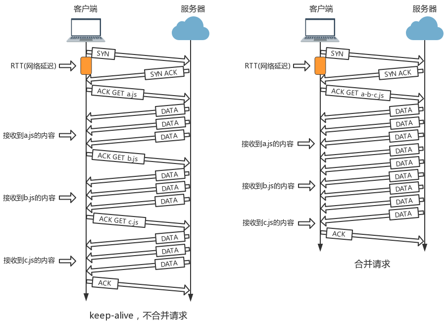
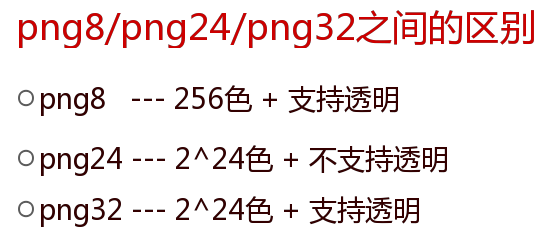

# Web 性能优化

- 网络层面
- 构建层面
- 浏览器渲染层面
- 服务端层面

> **深入理解 http 请求是前端性能优化的核心**

## 可优化的地方

- **资源的合并与压缩**

  > 减少 http 请求数量 和 减少请求资源大小

  - html 压缩

    - nodejs 提供的 `html-minifier` 压缩
    - 后端模板引擎渲染压缩

  - css 压缩

    压缩点：

    - 删除无效代码
    - 删除注释
    - css 语义合并

    压缩方法：

    - 使用 `html-minifier` 对 html 中的 css 进行压缩
    - 使用 `clean-css` 对 css 进行压缩

  - JavaScript 压缩与混乱

    压缩点：

    - 删除无效字符
    - 删除注释
    - 代码语义的缩减和优化
    - 代码保护（混乱代码，降低可读性，增加安全）

    压缩方法：

    - 使用 `html-minifier` 对 html 中的 js 进行压缩
    - 使用 `uglifyjs2` 对 js 进行压缩

  **不进行文件合并带来的一些问题：**

  

  - 文件与文件之间有插入的上行请求，增加了网络请求
  - 丢包问题可能会更严重
  - 经过代理服务器时可能被断开

  **文件合并存在的问题：**

  - 首屏渲染时间延长
  - 缓存失效（合并的文件有一个存在改动，都会使合并的大文件缓存失效）

  **文件合并可取的办法：**

  - 公共库合并
  - 不同页面分别合并（按需加载）

- 图片类型选择

  - jpg 压缩率高
  - png 浏览器兼容性好

    

  - webp 压缩程度更好（在 iOS webview 有兼容问题）

  > 如果可以，安卓端建议全部使用 webp

  - svg 代码内嵌，相对较小，适用于图片样式简单的场景

  - CSS 雪碧图

  > 优点：减少 HTTP 请求
  > 缺点：合成的图片可能会很大，如果合成图片加载失败，造成的应该比较大
  >
  > **实际中应该：在保证合成图片不过大的前提下使用**

  > 在线获取雪碧图坐标数据：[http://www.spritecow.com/](http://www.spritecow.com/)

  - 图片转 base64 嵌入 HTML

  > 减少 HTTP 请求

- 浏览器渲染机制

  

  - 整个网页从上到下顺序加载解析
  - 网络资源会并发请求（存在并发上限）

  CSS 阻塞：

  > 如果过 CSS 没有放在 head 标签中，可能会出现 DOM 结构加载完成之后，CSS 样式文件才加载完成，页面出现闪动，最终显示完整的页面布局。

  - CSS 会阻塞 JS 脚本的 **执行**（因为 JS 执行时可能会修改样式）
  - CSS 不会阻塞外部资源的 **加载**

  JS 阻塞：

  - 使用 src 普通引入的 JS（不用 async、defer）会阻塞页面加载（因为 JS 可能修改 DOM，和 CSS 阻塞 JS 执行原理一样）

  - JS 不会阻塞外部资源的 **加载**

- 懒加载 / 预加载

  - 懒加载

    - 图片进入可视区再加载

    > 页面需要显示很多图片时，用户不一定都会去看，这就需要用到懒加载。

  - 预加载

    - 图片等静态资源提前请求
    - 资源使用到时，从缓存中加载，提升用户体验

    > 一些图片等资源会在进入页面之后依次使用到（比如：进入页面之后的图片切换动画），这就需要用到预加载。
    >
    > 进行预加载资源时，显示 loading 动画，等到要用的资源预加载完成，再去渲染页面。

- 浏览器储存
- 缓存机制
- PWA
- Vue-SSR

++++++++++++++++++++++++++++++++++++++++++++

- 通过在线网站 和 fis3 两种实现压缩与合并

浏览器的一个请求从发送到返回都经历了什么？

潜在的性能优化点：

- 是否可以通过缓存减少 dns 查询时间？
- 是否网络请求的过程走最近的网络环境？
- 相同的静态资源是否可以缓存？
- 能否减少 http 请求的大小？
- 减少 http 请求次数
- 服务端渲染
