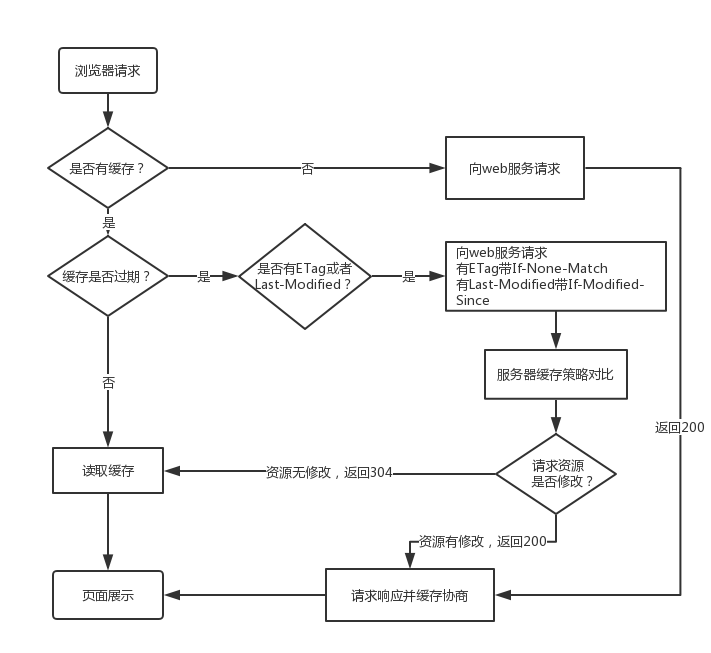

## 缓存模式

浏览器的缓存可分为两种模式：**强缓存**和**协商缓存**。

- 强缓存

  直接读取本地缓存，无 HTTP 请求，无协商，HTTP 响应状态码是 `200`（`from memory cache` 或 `from disk cache` 等，不同浏览器返回的信息不一致，但都是**从缓存读取**的意思）。

  涉及的 HTTP 标头：

  - `Cache-Control`
  - `Expires`

- 协商缓存

  虽然本地有缓存，但是不确定是否是最新的，于是询问服务器。若服务端判定资源未更新，则返回 `304 Not Modified`，客户端可以直接使用缓存；否则，返回 `200 OK`，并将最新的数据发给客户端。

  涉及的 HTTP 标头：

  - `Last-Modified / If-Modified-Since`
  - `ETag / If-None-Match`

一张图解缓存过程：



## 相关 HTTP 标头

- 理解 `Cache-Control` 所控制的缓存策略
- 理解 `Last-Modified` 和 `ETag` 以及整个服务端浏览器端的缓存流程

HTTP Header：

- `Cache-Control`

  - `Expires`

    > 设置资源的过期时间。告诉浏览器：在过期时间前，可以从缓存中直接读取资源。

  - `max-age`

    > 在 max-age 设置的时间内，客户端请求的资源都会从浏览器缓存中读取。
    > 优先级大于 `expires`。

  - `s-maxage`

    > 是对公共缓存设备（如：CDN，代理服务器）进行缓存设置。
    > 如果设置了 `s-maxage`，并且没有过期，资源就会向公共缓存设备请求。
    > 优先级大于 `max-age`。

  - `no-cache`

    > 始终发送请求去判断浏览器里的缓存资源是否过期。如果过期就从服务器获取资源，否则返回 304（响应不带 body），并使用浏览器中的缓存。
    >
    > 另外，这个属性需要配合 `max-age=0` 来使用。

  - `no-store`

    > 对指定的文件完全不使用缓存策略。

- `Last-Modified` / `If-Modified-Since`

  > 其中 `Last-Modified` 是 HTTP 响应头，`If-Modified-Since` 是 HTTP 请求头。
  > 需要与 `cache-control` 共同使用。

  使用这个 HTTP Header 的缺点：

  - 某些服务端不能获取精确的修改时间
  - 文件修改时间变了，文件内容却没有变

- `ETag` / `If-None-Match`

  > 这个 HTTP Header 用来解决 `Last-Modified` / `If-Modified-Since` 的缺点。
  > 它们的值是一个标识文件不同的 MD5 戳。如果 `ETag` 和 `If-None-Match` 的值相同，证明文件没有改变。
  > 优先级大于 `Last-Modified` / `If-Modified-Since`

**浏览器分级缓存策略：**


> 304 也可以同时更新缓存文件的过期时间。

## ETag

ETag 是 HTTP 响应的首部字段，**用于唯一标识资源的特定版本**。当资源的更新时，ETag 也会随之更新。

生成 ETag 值的算法不是统一的，由服务端决定。例如可以是：内容的 Hash、最新修改时间的 Hash、版本号等。

### 强 ETag

强 ETag，无论资源发生多么细微的变化，都会改变 ETag 的值。

### 弱 ETag

弱 ETag 只用于提示资源是否相同。只有资源发生根本变化，产生差异时才会改变 ETag 值。此时，在值前面添加 `W/`（注意大写），例如：

```http
ETag: W/"123456"
```

相同资源的两个弱 ETag 的值，可能语义相同，但不是每个字节都相同。

### ETag 的作用

- 避免“空中碰撞”（mid-air collisions）

  所谓“空中碰撞”，就是防止对同一文件的多次修改相互覆盖。例如：张三正在修改 `a.txt`，在张三还没修改完之前，李四就已经修改并保存了 `a.txt`。此时，如果张三保存修改，就会覆盖李四的修改。解决方法是：让张三的这次修改失败，使其在李四修改的基础上再进行修改。

  借助 `ETag` 和 `If-Match` 字段，可以检测空中编辑冲突。例如：

  在编辑 MDN 文档时，将 Wiki 的内容 Hash 处理，并将其放入 ETag 响应中：

  ```http
  ETag: "123456"
  ```

  如果修改了文档，发布数据时，`POST` 请求将包含 `If-Match` 字段（其值是 ETag 值）：

  ```http
  If-Match: "123456"
  ```

  如果服务端验证 `If-Match` 和 `ETag` 的值不匹配，证明文档已经编辑过，因此这次修改无效，返回 `412 Precondition Failed` 状态码。

- 缓存资源

  借助 `ETag` 和 `If-None-Match` 字段。客户端发送请求时，带上 `If-None-Match` 字段（其值是 ETag 值）:

  ```http
  If-None-Match: "123456"
  ```

  然后服务端验证 `If-None-Match` 的值，是否与资源当前的 `ETag` 值匹配。如果相同，则资源未修改，返回 `304 Not Modified` 状态码；否则资源修改了，返回 `200 OK` 状态码。

---

参考资料：

- [浏览器之 HTTP 缓存的那些事](https://segmentfault.com/a/1190000016546106)
