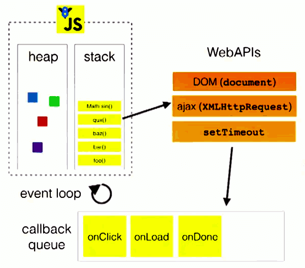
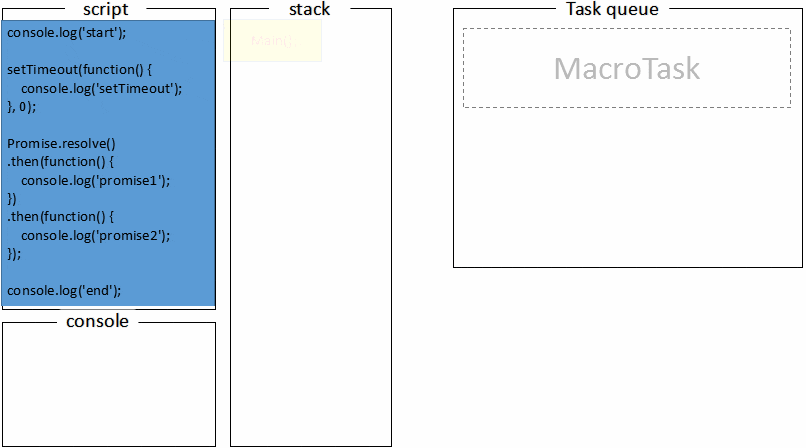

- [深入理解 JS 事件循环机制（浏览器篇）](#深入理解-js-事件循环机制浏览器篇)
  - [单线程和异步](#单线程和异步)
  - [事件循环机制](#事件循环机制)
  - [宏任务和微任务](#宏任务和微任务)
  - [宏/微任务队列](#宏微任务队列)
  - [视图渲染](#视图渲染)

# 深入理解 JS 事件循环机制（浏览器篇）

[相关标准规范文档](https://html.spec.whatwg.org/multipage/webappapis.html#event-loop-processing-model)

众所周知，JavaScript 是一门**单线程**的**非阻塞**的语言，这是由于其最初的用途“与浏览器交互”决定的。

**单线程**：JavaScript 代码在执行的时候，只有一个主线程来处理任务。

尽管后来 HTML5 中加入了 Web Worker 标准，允许 JavaScript 创建多个子线程，但是子线程完全受主线程控制、无法操作 DOM、主线程可以随时终止子线程 等。所以，仍然没有改变 JavaScript 是单线程的本质。

**非阻塞**：JavaScript 代码执行时，如果遇到异步任务，并不会立即执行，而是将其加入“任务队列”（task queue），直到条件允许时，再被主线程调用。

## 单线程和异步

单线程实现异步，其背后的原理就是本文的重点“事件循环”（Event Loop）。

JavaScript 中的任务分为两种：**同步任务**和**异步任务**。它们的处理方式分别如下：

- **同步任务**：直接将同步任务在主线程上排队执行
- **异步任务**：先将异步任务加入“**任务队列**”，等条件合适时，再移到**调用栈（call stack）**，然后被主线程调用

由异步任务的处理方式就可以看出，它不会造成主线程阻塞。例如，发送一个 Ajax 请求后，浏览器会继续做其他的任务，响应回来后，其对应的回调函数被添加到任务队列中等待执行，因此，并没有阻塞主线程。

## 事件循环机制

函数调用时，会形成一个栈帧，栈帧中包含了当前函数的参数和局部变量等**上下文信息**。函数执行完毕后，它的上下文会从调用栈中弹出。

**事件循环**（Event Loop）过程：JavaScript 主线程在执行时，从“任务队列”中读取事件，然后放入“调用栈”来执行，整个过程不断循环。

调用栈和任务队列的关系如下图所示：



> 图片来源：http://vimeo.com/96425312

## 宏任务和微任务

TL;DR

1. 掌握常见宏任务、微任务
2. `Promise` 构造函数里的代码，属于同步任务
3. `Promise` 状态一旦确定，就不再改变，哪怕抛出异常（此时该异常将成为“未捕获的异常”）
4. `.then/.catch/.finally` 链式调用时，上一个执行完后，才会把下一个加入微队列
5. `await` 需要“右侧的表达式有确定的值（非 `Promise`、`Promise` 状态确定）”才会放行，否则将一直等待
6. `await` 语句执行后，会把其**下面的**代码加入微任务队列
7. `async` 函数的返回值是 `Promise` 类型（函数需等待 2 个微任务的时间，然后放行，继续**下面**的代码）

---

宏任务（Macro Task）

- script（主代码块）
- 定时器（`setTimeout`/`setInterval`/`setImmediate（Node.js）`）
- `MessageChannel`
- DOM 操作
- 事件回调
- I/O 操作（文件 IO、网络 IO）
- UI 渲染

微任务（Micro Task）

- `Promise 的 .then/.catch/.finally`
- `await 下面的代码`
- `MutationObserver`
- [`queueMicrotask`](https://developer.mozilla.org/en-US/docs/Web/API/queueMicrotask)
- `Process.nextTick（Node.js）`
- `Object.observe（废弃）`

注意事项：

1. `Promise` 构造函数里的代码，属于同步任务
2. `Promise` 状态一旦确定，就不再改变，哪怕抛出异常（此时该异常将成为“未捕获的异常”）
3. `.then/.catch/.finally` 链式调用时，上一个执行完后，才会把下一个加入微队列
4. `await` 需要“右侧的表达式有确定的值（非 `Promise`、`Promise` 状态确定）”才会放行，否则将一直等待
5. [async 函数返回值](https://juejin.cn/post/7194744938276323384#heading-1)

   1. 返回值：非 thenable、非 `Promise`（函数不等待）
   2. 返回值：thenable（函数需等待 1 个微任务的时间，然后放行，继续**下面**的代码）
   3. 返回值：`Promise` 类型（函数需等待 2 个微任务的时间，然后放行，继续**下面**的代码）

6. [await 右值类型区别](https://juejin.cn/post/7194744938276323384#heading-2)

   前置知识：**`await` 语句执行后，会把其下面的代码加入微任务队列**。

   > 为了方便阅读，下文我们称「`await` 语句下面被加入微任务队列的代码」为 AAA。

   下面是“`await` 右值接不同类型”时，代码块 AAA **加入微队列的时机**：

   1. 接非 thenable 类型：AAA 不等待，直接加入微队列
   2. 接 thenable 类型：AAA 等待 1 个微任务的时间，再加入微队列
   3. 接**状态确定** `Promise` 类型：AAA 不等待，直接加入微队列

   > TC 39 对 `await` 后面是 `Promise` 的情况如何处理进行了一次修改，移除了额外的两个微任务，在早期版本，依然会等待两个微任务的时间。

代码示例：

```js
function fn() {
  return new Promise((resolve) => {
    resolve();
  }).then(() => console.log(1));
}

fn();
Promise.resolve()
  .then(() => console.log(2))
  .then(() => console.log(3))
  .then(() => console.log(4));

// 依次打印：1 2 3 4
```

```js
function fn() {
  return new Promise((resolve) => {
    resolve();
  });
}

fn().then(() => console.log(1));
Promise.resolve()
  .then(() => console.log(2))
  .then(() => console.log(3))
  .then(() => console.log(4));

// 依次打印：1 2 3 4
```

```js
// 有了 async 修饰后，执行规则就变了，参考上文「async 函数返回值 - 第三条规则」
async function fn() {
  return new Promise((resolve) => {
    resolve();
  });
}

fn().then(() => console.log(1));
Promise.resolve()
  .then(() => console.log(2))
  .then(() => console.log(3))
  .then(() => console.log(4));

// 依次打印：2 3 1 4
```

题目练习：

1. 练习 1

   ```js
   async function async1() {
     console.log('1');
     await async2();
     console.log('2');
   }

   async function async2() {
     console.log('3');
   }

   console.log('4');

   setTimeout(function () {
     console.log('5');
   }, 0);

   async1();

   new Promise(function (resolve) {
     console.log('6');
     resolve();
   }).then(function () {
     console.log('7');
   });

   console.log('8');

   // 最终结果: 4 1 3 6 8 2 7 5
   ```

2. 练习 2

   ```js
   async function async1() {
     console.log('1');
     await async2(); // ！！！这里属于 async 返回值是 Promise，所以 await 后面的代码等待两个 then 时间后放行
     console.log('2');
   }

   async function async2() {
     console.log('3');
     return new Promise((resolve, reject) => {
       resolve();
       console.log('4');
     });
   }

   console.log('5');

   setTimeout(() => {
     console.log('6');
   }, 0);

   async1();

   new Promise((resolve) => {
     console.log('7');
     resolve();
   })
     .then(() => {
       console.log('8');
     })
     .then(() => {
       console.log('9');
     })
     .then(() => {
       console.log('10');
     });
   console.log('11');

   // 最终结果: 5 1 3 4 7 11 8 9 2 10 6
   ```

3. 练习 3

   ```js
   async function async1() {
     console.log(1);
     await async2();
     console.log(2);
   }

   async function async2() {
     await setTimeout(() => {
       Promise.resolve().then(() => {
         console.log(3);
       });
       console.log(4);
     }, 0);

     setTimeout(() => {
       console.log(5);
     }, 0);
   }

   async function async3() {
     Promise.resolve().then(() => {
       console.log(6);
     });
   }

   async1();
   console.log(7);
   async3();

   // 最终结果：1 7 6 2 4 3 5
   ```

## 宏/微任务队列

相应地，任务队列可以分为**微任务队列**和**宏任务队列**，它们的执行顺序如下图所示：


> 图片来源：http://lynnelv.github.io/js-event-loop-browser

如上图所示，一次 Event Loop 的具体过程如下：

1. 检查宏任务队列，不为空就执行其中**一个**宏任务；为空就去检查微任务队列。
2. 检查微任务队列，不为空则清空微任务队列。
3. 如果可以更新视图，则进行更新，否则进行下一次 Event Loop。

下面我们通过一个具体的示例来加深理解：

```js
console.log('start');

// setTimeout 属于宏任务
setTimeout(function () {
  console.log('setTimeout');
}, 0);

Promise.resolve()
  .then(function () {
    // Promise.then 回调属于微任务
    console.log('promise1');
  })
  .then(function () {
    // Promise.then 回调属于微任务
    console.log('promise2');
  });

console.log('end');
```

执行过程如下图所示：



> 图片来源：http://lynnelv.github.io/js-event-loop-browser

> 答案：start end promise1 promise2 setTimeout

首先，主代码块（`Main()`）入栈，打印 start。

然后，遇到 `setTimeout`，将其加入宏任务队列，代码继续向下执行。

遇到 `Promise.then`，将其回调加入微任务队列，代码继续向下执行。

打印 end。此时，主代码块执行结束，`Main()` 出栈。由于主代码块（`Main()`）属于宏任务，所以根据 Event Loop 执行过程可知，执行完**一个**宏任务后，会去检查微任务队列。

然后，**清空微任务队列**和**执行一个宏任务**依次交替进行，直到所有任务执行完毕。

## 视图渲染

回顾上文中的 Event Loop，视图渲染（update rendering）可能会发生在微任务队列清空后，但是是否更新，由浏览器决定。

我们知道，现代浏览器通常以 60 FPS 来刷新页面，也就是大约 16.7ms 渲染一帧。而视图渲染需要在一次 Event Loop 之后进行，所以任务队列中事件的执行时间，影响了页面的渲染帧率。

为了让页面流畅渲染，**一个宏任务**和**它相关的微任务**（也就是一次 Event Loop）最好能再 16.7ms 内完成。否则，一帧中没有多余的时间来更新视图，只能放到下一帧再更新，从而造成了**丢帧**。

但也不是每轮 Event Loop 都会更新视图。比如，有可能好几轮 Event Loop 的总耗时还未大于 16.7ms。因此，如果每帧都进行视图渲染，则会比较浪费资源。所以，可以使用 `requestAnimationFrame` 来进行优化，确保**每帧最多只进行一次**视图渲染（也可能一帧中没有视图渲染），也就是说 `requestAnimationFrame` 的执行时机是一次或多次 Event Loop 后
页面重绘（reprint）前。

以下代码可以验证：

```js
console.log('start');

setTimeout(function () {
  console.log('timer1');
}, 0);

requestAnimationFrame(function () {
  console.log('requestAnimationFrame');
});

setTimeout(function () {
  console.log('timer2');
}, 0);

Promise.resolve().then(function () {
  console.log('promise1');
});

console.log('end');
```

执行结果如下：

```js
start;
end;
promise1;
requestAnimationFrame; // 一次 Event Loop 后执行
timer1;
timer2;

// 或者

start;
end;
promise1;
timer1;
timer2;
requestAnimationFrame; // 多次 Event Loop 后执行
```

总的来说，浏览器只保证 `requestAnimationFrame` 的回调在重绘之前执行，没有确定的时间，何时重绘由浏览器决定。

---

- [你不知道的 async、await 魔鬼细节](https://juejin.cn/post/7194744938276323384#heading-1)
- [详解 JavaScript 中的 Event Loop（事件循环）机制](https://zhuanlan.zhihu.com/p/33058983)
- [JavaScript 运行机制详解：再谈 Event Loop](http://www.ruanyifeng.com/blog/2014/10/event-loop.html)
- [深入理解 js 事件循环机制（浏览器篇）](http://lynnelv.github.io/js-event-loop-browser)
- [async/await 在 chrome 环境和 node 环境的 执行结果不一致，求解？ - 贺师俊的回答 - 知乎](https://www.zhihu.com/question/268007969/answer/339811998)
