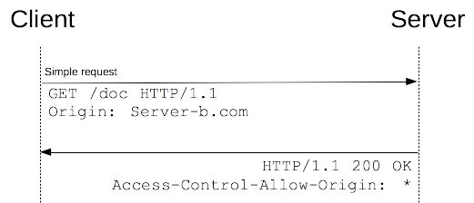
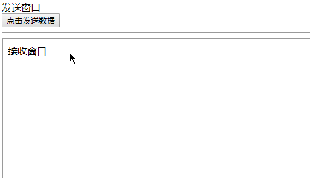

- [HTML5 安全](#html5-安全)
  - [新标签、属性带来的危险](#新标签属性带来的危险)
  - [sandbox 属性](#sandbox-属性)
  - [noreferrer 属性](#noreferrer-属性)
  - [CORS](#cors)
  - [postMessage](#postmessage)
    - [安全问题](#安全问题)
  - [Web Storage](#web-storage)

# HTML5 安全

## 新标签、属性带来的危险

HTML5 引入的新标签包括 `<audio>` `<video>` `<canvas>` 等，同时这些标签有一些有趣的属性，例如：`poster` `autofocus` `onerror` `formaction` `oninput`，这些属性都可以执行 JS，从而可能会导致 XSS 和 CSRF 攻击。

例如：

- 视频加载失败，执行 onerror 事件

  ```html
  <video><source src="" onerror="javascript:alert(1);" /></video>
  ```

- 下面的 poster 属性链接到一个图像，当视频未响应或缓冲不足时，显示占位符

  ```html
  <video poster="javascript:alert(1);"></video>
  ```

- autofocus 会让元素自动的获取焦点，而 formaction 属性能覆盖 form 元素的 action 属性

  ```html
  <input autofocus onfocus="alert(1)" />
  <form>
    <button formaction="javascript:alert(1)"></button>
  </form>
  ```

## sandbox 属性

在 HTML5 中 iframe 有一个新属性 sandbox，使用 sandbox 属性后，iframe 加载的内容将被视为一个独立的 “源”。

如果这个属性值为空字符串（`sandbox=""`）那么将启用所有限制。其中脚本将被禁止执行，表单将被进制提交，插件将被进制加载，指向其他浏览器对象的链接将被进制。

也可以进行精确控制：

- `allow-same-origin`：允许同源访问
- `allow-top-navigation`：允许访问顶层窗口
- `allow-forms`：允许表单提交
- `allow-scripts`：允许脚本执行
  > 即使设置了允许脚本执行，一些行为也是不允许的，例如 “弹出窗口”。

## noreferrer 属性

HTML5 中为 `<a>` `<area>` 新增了 noreferrer 属性。当为这两个标签添加了这个属性后，请求链接时将不会再带上 Refer。

## CORS

> 详细用法：[https://developer.mozilla.org/zh-CN/docs/Web/HTTP/Access_control_CORS](https://developer.mozilla.org/zh-CN/docs/Web/HTTP/Access_control_CORS)

跨域资源共享（CORS）是一种机制，用于解决跨域问题，它通过设置额外的 HTTP 头来告诉浏览器是否允许跨域。

当客户端发起请求时，需要带上 HTTP 头 Origin，而服务端需要设置字段 `Access-Control-Allow-Origin`：



## postMessage

> 详细用法：[https://developer.mozilla.org/zh-CN/docs/Web/API/Window/postMessage](https://developer.mozilla.org/zh-CN/docs/Web/API/Window/postMessage)

postMessage 用于跨窗口传递消息，它允许每一个 window（当前窗口，弹出窗口，iframe 等）对象往其他窗口发送文本消息，从而实现跨窗口传递消息，这个功能不受同源限制。

一些用法如下：

- 使用弹出窗口

`index.html`

```html
<div>发送窗口</div>
<button id="button">点击发送数据</button>

<script>
  var button = document.getElementById('button');
  var win = window.open('./test.html');

  button.onclick = function () {
    win.postMessage('hello world', 'https://liuyib.github.io/');
  };
</script>
```

同目录下的 `test.html`

```html
<div>接收窗口</div>
<div id="showData"></div>

<script>
  var showData = document.getElementById('showData');

  window.addEventListener(
    'message',
    function (e) {
      showData.innerText = e.origin + ' said: ' + e.data;
    },
    false
  );
</script>
```

假如上面新开的浏览器窗口没有被阻止，那么当点击 “发送数据” 的按钮时，接收窗口就会接收到信息。效果如下：


> Demo 体验地址：[https://liuyib.github.io/blog/demo/note/h5-postMessage-win-open/index.html](https://liuyib.github.io/blog/demo/note/h5-postMessage-win-open/index.html)

- 使用 `iframe`

发送消息的 HTML 文件

```html
<div>发送窗口</div>
<button id="button">点击发送数据</button>

<hr />

<iframe
  id="iframe"
  src="https://liuyib.github.io/pages/demo/notes/h5-postMessage-iframe/test.html"
  width="600"
  height="400"
></iframe>

<script>
  var button = document.getElementById('button');
  var win = document.getElementById('iframe').contentWindow;

  button.onclick = function () {
    win.postMessage('hello world');
  };
</script>
```

接收消息的 HTML 文件

```html
<div>接收窗口</div>
<div id="showData"></div>

<script>
  var showData = document.getElementById('showData');

  window.addEventListener(
    'message',
    function (e) {
      showData.innerText = e.origin + ' said: ' + e.data;
    },
    false
  );
</script>
```

效果如下：


> Demo 体验地址：[https://liuyib.github.io/blog/demo/note/h5-postMessage-iframe/index.html](https://liuyib.github.io/blog/demo/note/h5-postMessage-iframe/index.html)

### 安全问题

不监听 message 事件可以完全解决安全问题。

如果希望接收其他网站的 message，要始终使用 origin 和 source 属性验证消息发送者的身份。其中通过 origin 验证发送者的 “源”，通过 source 向发送者回应消息。

代码示例如下：

发送消息的 HTML 文件

```html
<div>发送窗口</div>
<div id="recData"></div>
<button id="button">点击发送数据</button>

<hr />

<iframe
  id="iframe"
  src="https://liuyib.github.io/pages/demo/notes/h5-postMessage-iframe-secure/test.html"
  width="600"
  height="400"
></iframe>

<script>
  var button = document.getElementById('button');
  var win = document.getElementById('iframe').contentWindow;

  button.onclick = function () {
    win.postMessage('hello world');
  };

  var recData = document.getElementById('recData');

  window.addEventListener(
    'message',
    function (e) {
      if (e.origin !== 'https://liuyib.github.io') {
        return;
      }

      recData.innerText = e.origin + ' said: ' + e.data;
    },
    false
  );
</script>
```

接收消息的 HTML 文件

```html
<div>接收窗口</div>
<div id="showData"></div>

<script>
  var showData = document.getElementById('showData');

  window.addEventListener(
    'message',
    function (e) {
      if (e.origin !== 'https://liuyib.github.io') {
        return;
      }

      showData.innerText = e.origin + ' said: ' + e.data;

      e.source.postMessage('This is response', e.origin);
    },
    false
  );
</script>
```

效果如下：



这样，当发送者不是来自指定的域时，就不会接收消息，并且通过 source 属性向发送者回应了一条消息用于确认身份。

> Demo 体验地址：[https://liuyib.github.io/blog/demo/note/h5-postMessage-iframe-secure/index.html](https://liuyib.github.io/blog/demo/note/h5-postMessage-iframe-secure/index.html)

## Web Storage

Web Storage 分为 Session Storage 和 Local Storage。遵循同源策略。攻击者有可能将恶意代码存入其他进行跨页面攻击。
