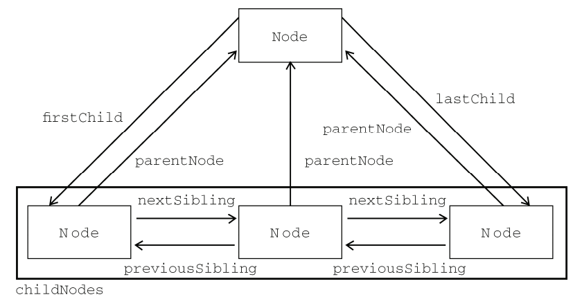

## 1、DOM 是针对 HTML 和 **XML** 的一套 API。

## 2、文档元素

文档元素是每个文档的根节点，在 `HTML` 中，文档元素始终是 `<html>`；在 `XML` 中，没有预定的元素，因此任何元素都有可能成为文档元素。

## 3、节点类型

`DOM1` 中定义了一个 `Node` 接口，`JS` 中作为 `Node` 类型实现了这个接口。`JS` 中总共有 `12 种节点类型`，这些节点类型都继承自 `Node` 类型，并都有一个 `nodeType` 属性。这些节点类型中，常用的是 `元素、文本、注释` 节点，他们的 `nodeType` 分别是 `1、3、8`。

## 4、nodeName 和 nodeValue 属性

> 这两个属性的值取决于节点类型（所以使用之前最好检测一下节点类型）。
> 例如：元素节点的 nodeName 是元素名，nodeValue 是 null

## 5、访问节点

访问子节点：

- childNodes 属性
- firstChild
- lastChild

childNodes 属性中保存着 NodeList 对象。NodeList 对象是一种类数组对象。
其中

```javascript
childNodes[0] == firstChild
childNodes[childNodes.length - 1] == lastChild
```

如果没有子节点，则 firstChild, lastChild 均为 null。

> 注意：上面这三个属性，会获取 `所有类型的节点`。由于代码缩进的原因，我们平时写代码使用：`someNode.firstChild, someNode.childNodes[0]` 等，获取到的一般是一个文本节点。并不能直接按照索引获取我们想要的元素节点！

访问父节点：

- parentNode 属性

访问兄弟节点：

- previousSibling
- nextSibling

> 如果一个节点没有上一个 / 下一个节点，那么他的 previousSibling / nextSibling 属性为 null。

节点之间的访问属性可以用下图表示：



访问根节点：

- ownerDocument

这是所有节点都有的一个属性，该属性表示整个文档节点。通过这个属性，我们可以不必在节点层次中层层回溯到达顶端，而是可以直接访问 `根节点`。

- hasChildNodes() 判断是否有 `子节点`（12 种节点之一）

## 6、操作节点

- appendChild()

该方法接收一个参数：`新增的节点`。同时会返回 `新增的节点`。

如果传入的节点 `已经是文档的一部分`，那么该节点会从 `原来的位置` 移动到 `节点末尾`。即起到了移动节点的作用。例如：

```javascript
// someNode 有多个子节点
var returnNode = someNode.appendChild(someNode.firstChild);
console.log(returnNode == someNode.firstChild); // false
console.log(returnNode == someNode.lastChild);  // true
```
- insertBefore()

该方法接收两个参数：`新增的节点` 和 `参照的节点`。同时会返回 `新增的节点`。

如果 `参照节点` 为 `null`，则作用和 `appendChild` 一样。例如：

```javascript
// 插入成为最后一个节点
var returnNode = someNode.insertBefore(newNode, null);
console.log(returnNode == newNode); // true
console.log(returnNode == someNode.lastChild); // true

// 插入成为第一个节点
var returnNode = someNode.insertBefore(newNode, someNode.firstChild);
console.log(returnNode == someNode.firstChild); // true

// 插入到最后一个节点前面
var returnNode = someNode.insertBefore(newNode, someNode.lastChild);
console.log(returnNode == someNode.childNodes[someNode.childNodes.length - 2]); // true
```

- replaceChild()

该方法接收两个参数：`新增的节点` 和 `替换的节点`。同时会返回 `替换的节点`。例如：

```javascript
// 替换第一个子节点
someNode.replaceChild(newNode, someNode.firstChild);

// 替换最后一个子节点
someNode.replaceChild(newNode, someNode.lastChild);
```

被替换的节点虽然在文档中没了自己的位置，但是仍然存在。例如：

```html
<div id="oDiv">
  <span>1</span>
  <span>2</span>
  <span>3</span>
  <span>4</span>
</div>
```

```javascript
var oDiv = document.getElementById("oDiv");
var aSpans = oDiv.getElementsByTagName('span');
var oNewNode = document.createElement("span");
oNewNode.innerHTML = "new node";

var replaceNode = oDiv.replaceChild(oNewNode, aSpans[1]);

console.log(replaceNode); // <span>2</span>
```

- removeChild()

该方法接收一个参数：`要删除的节点`。同时会返回 `要删除的节点`。例如：

```javascript
// 删除第一个节点
someNode.removeChild(someNode.firstChild);

// 删除最后一个节点
someNode.removeChild(someNode.lastChild);
```

上面这四个方法操作的都是 `某个节点的子节点`。所以，在使用这几个方法之前，需要先获取父节点。但并不是所有的节点都有子节点。如果在不支持子节点的节点上调用了这个方法，会导致错误。

## 7、其他方法

- cloneNode()

该方法用于复制一个节点，接收一个布尔值参数。参数为 `true`，表示深复制，会复制节点及其整个子节点树；参数为 `false`，表示浅复制，只会复制节点本身。

```html
<ul id="oUl">
  <li>1</li>
  <li>2</li>
  <li>3</li>
  <li>4</li>
</ul>
```

```javascript
var oUl = document.getElementById('oUl');
var deepClone = oUl.cloneNode(true);
var shallowClone = oUl.cloneNode(false);

console.log(deepClone); // <ul id="oUl">
                        //   <li>1</li>
                        //   <li>2</li>
                        //   <li>3</li>
                        //   <li>4</li>
                        // </ul>

console.log(shallowClone); // => <ul id="oUl"></ul>
```

- normalize()

该方法用于处理文档树中的文本节点。由于解释器的实现或者 `DOM` 操作的原因，可能会出现文本节点中不包含文本，或连续出现两个文本节点。在某个节点上调用这个方法，就会在该节点的后代节点中查找上面两种情况。找到空白节点删除，则删除；找到连续的两个文本节点，则合并为一个文本节点。

## 8、Document 类型

`Document` 表示整个文档。在浏览器中常用的是 `document` 对象，它是 `HTMLDocument` 类型的示例（`HTMLDocument` 继承自 `Document` 类型），同时它也是 `window` 对象的一个属性。

8.1、文档子节点

文档的子节点可能是：`DocumentType`（最多一个）、`Element`（最多一个）、`ProcessingInstruction` 或 `Comment`。

访问其子节点的快捷方式有：

- documentElement
- childNodes

```javascript
var html = document.documentElement; // 获取对 <html> 的引用

console.log(html === document.childNodes[0]); // true
console.log(html === document.firstChild);    // true
```

类似于 `documentElement` 属性，`document` 对象还有一个 `body` 属性，用于获取对 `<body>` 的引用：

```javascript
var body = document.body; // 获取对 <body> 的引用
```

8.2、文档信息

- title 属性

包含着文档的标题（即 `<title>` 元素中的文本）。

- URL 属性

包含着页面的完整 URL。

- domain 属性

包含着页面的域名。

- referrer 属性

`referrer` 属性中保存着连接到当前页面的那个页面的 `URL`。

上面四个属性中 `title` 和 `domain` 是可写的。

其中 `domain` 并不是可以设置为任何值，有一些限制：

- 不能设置为 `URL` 中不包含的域：

```javascript
// 假设页面来自 p2p.wrox.com

document.domain = wrox.com     // => 成功
document.domain = nczonline.cn // => 出错
```

- 在根域范围内，域名不能从 “松散” 设置为 “绷紧”：

```javascript
// 假设页面来自 p2p.wrox.com

document.domain = wrox.com     // => 松散（成功）
document.domain = p2p.wrox.com // => 绷紧（出错！）
```

8.3、查找元素

- document.getElementById()

> IE <= 7 中：
> - 不区分 ID 的大小写（例如：myDiv 和 mydiv 被视为相同 ID）
> - 如果有表单元素的 name 和 元素 ID 相同，并且表单元素在前，则该方法会获取到这个表单元素。

- document.getElementsByClassName()

- document.getElementsByTagName()

- document.getElementsByName()

> 前两种方法会获取一个 HTMLCollection 对象，这个对象是一个 **动态的集合**，与 NodeList 很相似。
最后一个方法会获取到一个 NodeList 对象，这是一种类数组对象。

> 如果获取到的元素集合里的元素上面有 name 属性，则可以用该对象的 **namedItem() 方法** 或 **使用中括号** 取得这个元素：

```html


```

```javascript
var aImgs = document.getElementsByTagName('img');

console.log(aImgs.namedItem('myImg2')); // => 
console.log(aImgs['myImg2']);           // => 
```

8.4、特殊集合

- document.anchors - 获取带有 name 属性的 `<a>` 元素
- document.links - 获取带有 href 属性的 `<a>` 元素
- document.forms - 获取所有 `<form>` 元素
- document.images - 获取所有 `` 元素
- document.scripts - 获取所有 `<script>` 元素
- document.applets - 获取所有 `<applet>` 元素
- document.embeds - 获取所有 `<embed>` 元素
- document.plugins - 获取所有 `<embed>` 元素

> 这些方法都会返回一个 HTMLCollection 对象。

## 9、ELement 类型

- nodeType 为 1
- nodeName 为 标签名
- nodeValue 为 null

> 要访问标签名，可以使用 `nodeName` 或 `tagName` 属性，后者主要是为了清晰起见。两个属性返回的都是标签名的 `全大写` 形式。例如，对 `<div>` 元素 操作，返回：DIV。所以和字符串进行比较操作时，最好转换一下大小写。

9.1、HTML 元素

所有的 HTML 元素都存在一下标准特性：

- id
- className - 因为 class 是 ECMAScript 中的保留字，所以在 DOM 中要使用 className 来访问元素的 class 属性。
- title - 鼠标经过元素时显示出来的就是 title 属性
- lang - 元素内容的语言
- dir - 文本的对齐方向（值为：`ltr：left-to-right`，从左至右（左对齐）；`rtl：right-to-left`，从右至左（右对齐））

> 这些属性都是可写的

9.2、操作属性

- getAttribute()

> 有两种属性，通过 `getAttribute` 获取到的值和通过 `对象属性` 获取到的值是不同的：
> 1. style - 行间样式
> 通过 `getAttribute` 获取到的是 style 里的 文本。
> 通过 对象属性（elem.style）获取到的是一个对象。
> 2. 事件处理程序（例如：onclick）

> **由于这些差别，所以平时只使用对象属性。只有获取自定义属性时，才使用 `getAttribute`**

- setAttribute()
- removeAttribute()

> 这些方法可以操作自定义属性（根据 H5 标准规定，自定义属性要加 `data-` 前缀）。
> 不过 HTML 中元素的自定义特性，在 DOM 中是不能作为属性访问到的（IE除外），例如：

```html
<div data-my-attribute="test"></div>
```

```javascript
var oDiv = document.getElementById('oDiv');

console.log(oDiv.getAttribute('data-my-attribute')); // => undefined（IE除外）
```
